# WarzonePhone Architecture

> Custom lossy VoIP protocol built in Rust. E2E encrypted, FEC-protected, adaptive quality, designed for hostile network conditions.

## System Overview

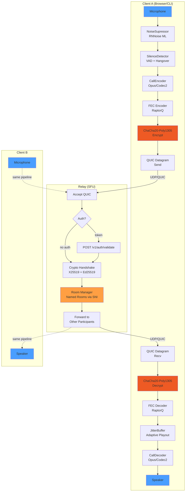

## Crate Dependency Graph


## Wire Formats

### MediaHeader (12 bytes)

```
Byte 0:  [V:1][T:1][CodecID:4][Q:1][FecHi:1]
Byte 1:  [FecLo:6][unused:2]
Bytes 2-3:  sequence (u16 BE)
Bytes 4-7:  timestamp_ms (u32 BE)
Byte 8:     fec_block_id (u8)
Byte 9:     fec_symbol_idx (u8)
Byte 10:    reserved
Byte 11:    csrc_count

V = version (0), T = is_repair, CodecID = codec, Q = quality_report appended
```

### MiniHeader (4 bytes, compressed)

```
Bytes 0-1: timestamp_delta_ms (u16 BE)
Bytes 2-3: payload_len (u16 BE)

Preceded by FRAME_TYPE_MINI (0x01). Full header every 50 frames (~1s).
Saves 8 bytes/packet (67% header reduction).
```

### TrunkFrame (batched datagrams)

```
[count:u16]
  [session_id:2][len:u16][payload:len]  x count

Packs multiple session packets into one QUIC datagram.
Max 10 entries or 1200 bytes, flushed every 5ms.
```

### QualityReport (4 bytes, optional)

```
Byte 0: loss_pct (0-255 maps to 0-100%)
Byte 1: rtt_4ms (0-255 maps to 0-1020ms)
Byte 2: jitter_ms
Byte 3: bitrate_cap_kbps
```

### SignalMessage (JSON over reliable QUIC stream)

```
[4-byte length prefix][serde_json payload]

Variants:
  CallOffer    { identity_pub, ephemeral_pub, signature, supported_profiles }
  CallAnswer   { identity_pub, ephemeral_pub, signature, chosen_profile }
  IceCandidate { candidate }
  Hangup       { reason: Normal|Busy|Declined|Timeout|Error }
  AuthToken    { token }
  Hold, Unhold, Mute, Unmute
  Transfer     { target_fingerprint, relay_addr }
  TransferAck
  Rekey        { new_ephemeral_pub, signature }
  QualityUpdate { report, recommended_profile }
  Ping/Pong    { timestamp_ms }
```

## Quality Profiles

```mermaid
graph LR
    subgraph GOOD ["GOOD (28.8 kbps)"]
        G_C[Opus 24kbps]
        G_F[FEC 20%]
        G_FR[20ms frames]
    end

    subgraph DEGRADED ["DEGRADED (9.0 kbps)"]
        D_C[Opus 6kbps]
        D_F[FEC 50%]
        D_FR[40ms frames]
    end

    subgraph CATASTROPHIC ["CATASTROPHIC (2.4 kbps)"]
        C_C[Codec2 1200bps]
        C_F[FEC 100%]
        C_FR[40ms frames]
    end

    GOOD -->|"loss>5% or RTT>100ms<br/>3 consecutive reports"| DEGRADED
    DEGRADED -->|"loss>15% or RTT>200ms<br/>3 consecutive"| CATASTROPHIC
    CATASTROPHIC -->|"loss<5% and RTT<100ms<br/>3 consecutive"| DEGRADED
    DEGRADED -->|"loss<5% and RTT<100ms<br/>3 consecutive"| GOOD

    style GOOD fill:#00b894
    style DEGRADED fill:#fdcb6e
    style CATASTROPHIC fill:#e17055
```

## Cryptographic Handshake

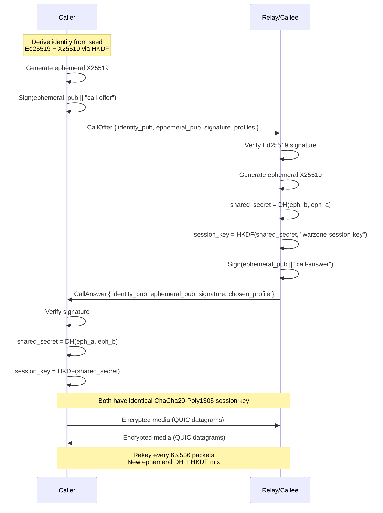

## Identity Model (featherChat Compatible)

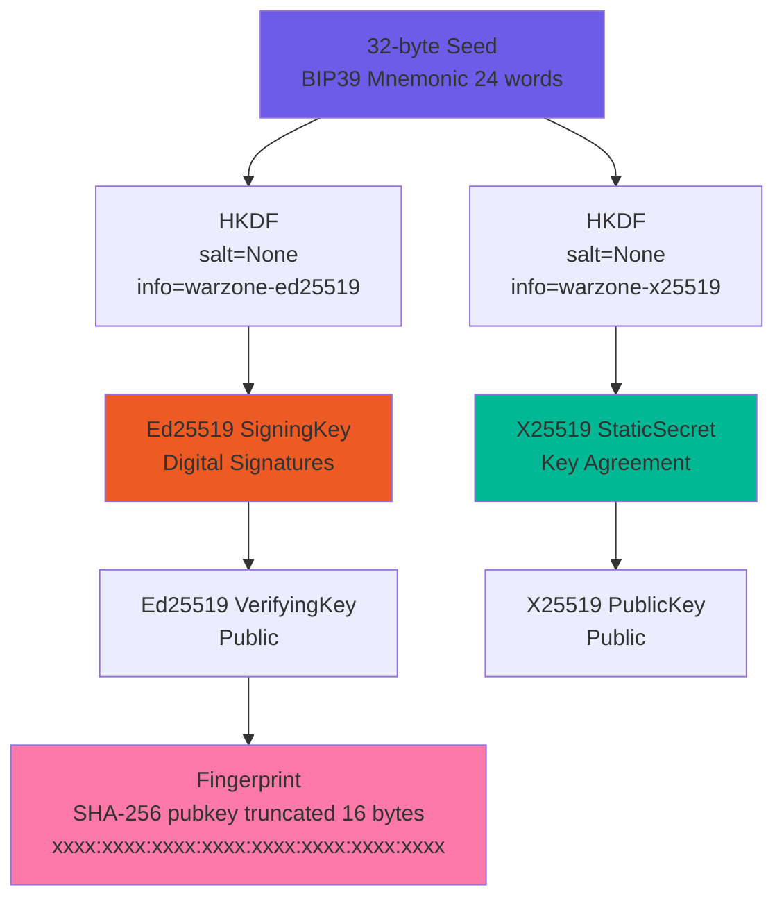

## Relay Modes

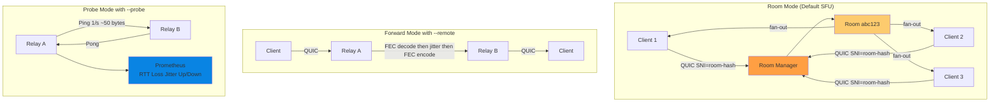

## Web Bridge Architecture

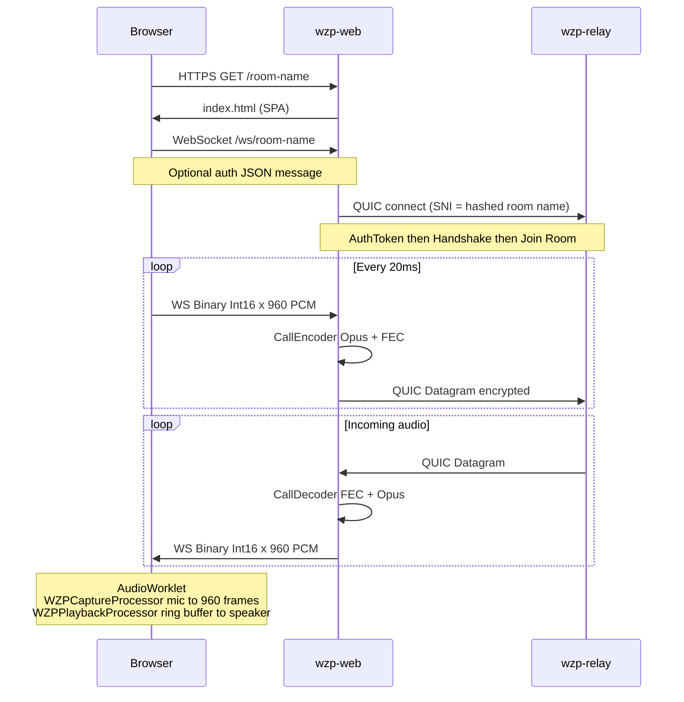

## FEC Protection (RaptorQ)

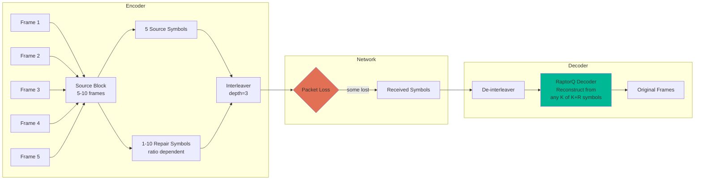

## Telemetry Stack

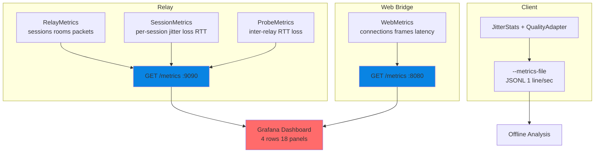

## Session State Machine

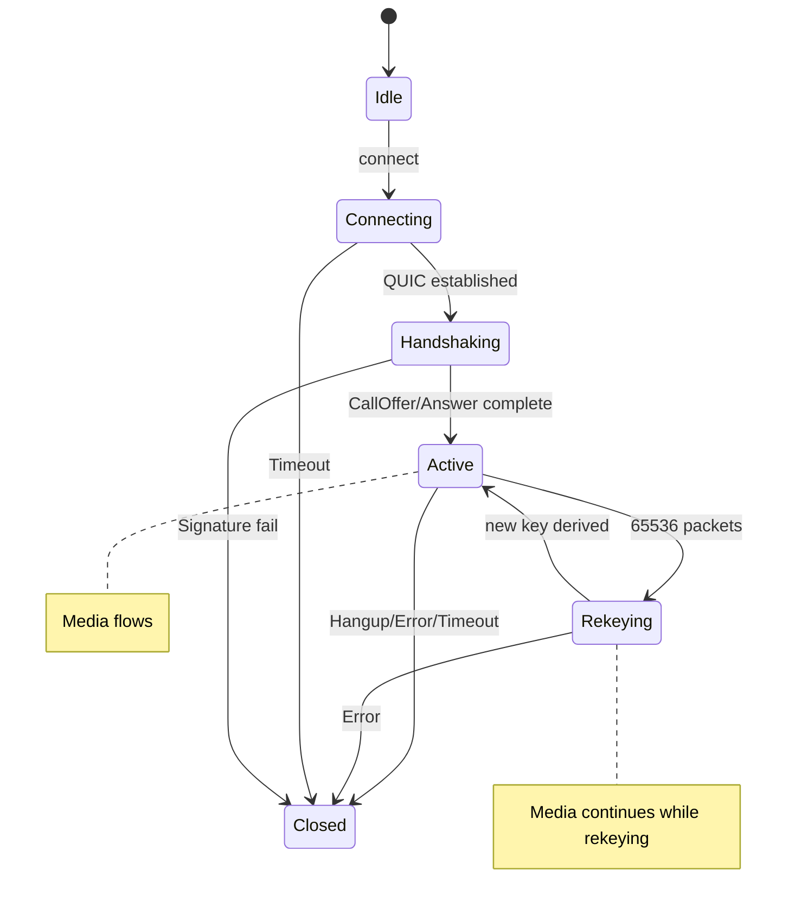

## Audio Processing Pipeline Detail

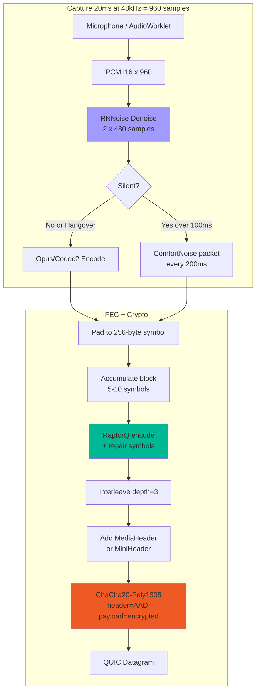

## Adaptive Jitter Buffer

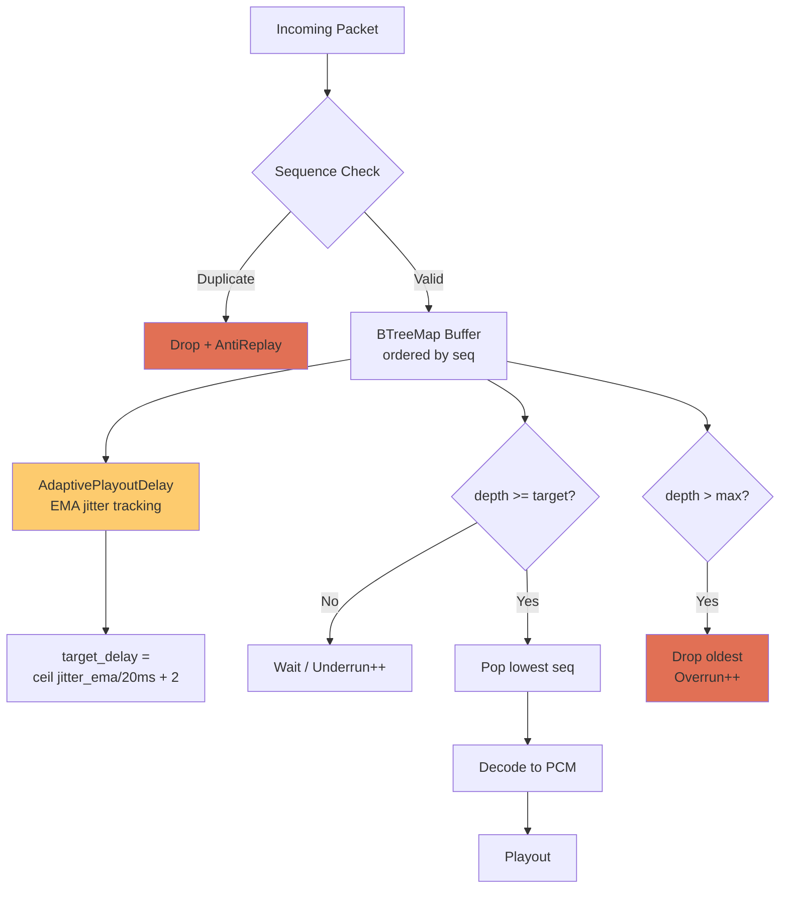

## Deployment Topology

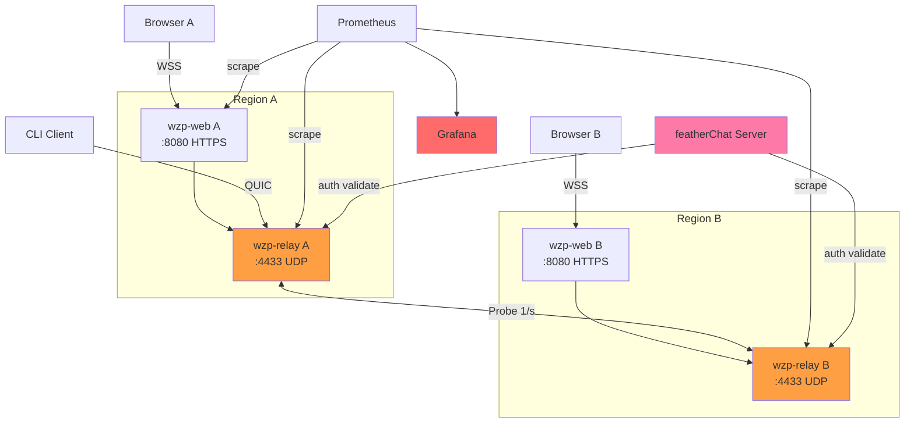

## featherChat Integration Flow

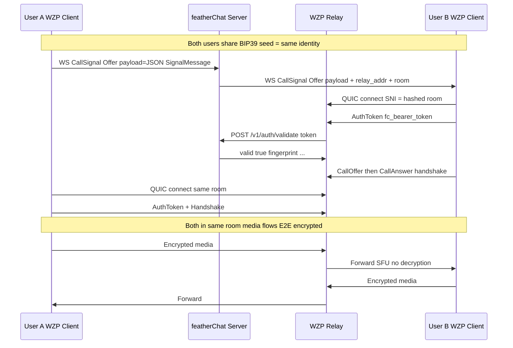

## Bandwidth Usage

| Profile | Audio | FEC Overhead | Total | Use Case |
|---------|-------|-------------|-------|----------|
| **GOOD** | 24 kbps (Opus) | 20% = 4.8 kbps | **28.8 kbps** | WiFi, LTE, good links |
| **DEGRADED** | 6 kbps (Opus) | 50% = 3 kbps | **9.0 kbps** | 3G, congested WiFi |
| **CATASTROPHIC** | 1.2 kbps (Codec2) | 100% = 1.2 kbps | **2.4 kbps** | Satellite, extreme loss |

With silence suppression: ~50% savings in typical conversations.
With mini-frames: 8 bytes/packet saved (67% header reduction).
With trunking: shared QUIC overhead across multiplexed sessions.

## Project Structure

```
warzonePhone/
├── Cargo.toml                    # Workspace root
├── crates/
│   ├── wzp-proto/                # Protocol types, traits, wire format
│   │   └── src/
│   │       ├── codec_id.rs       # CodecId, QualityProfile
│   │       ├── error.rs          # Error types
│   │       ├── jitter.rs         # JitterBuffer, AdaptivePlayoutDelay
│   │       ├── packet.rs         # MediaHeader, MiniHeader, TrunkFrame, SignalMessage
│   │       ├── quality.rs        # Tier, AdaptiveQualityController
│   │       ├── session.rs        # SessionState machine
│   │       └── traits.rs         # AudioEncoder, FecEncoder, CryptoSession, etc.
│   ├── wzp-codec/                # Audio codecs
│   │   └── src/
│   │       ├── adaptive.rs       # AdaptiveEncoder/Decoder (Opus + Codec2)
│   │       ├── denoise.rs        # NoiseSupressor (RNNoise/nnnoiseless)
│   │       └── silence.rs        # SilenceDetector, ComfortNoise
│   ├── wzp-fec/                  # Forward error correction
│   │   └── src/
│   │       ├── encoder.rs        # RaptorQFecEncoder
│   │       ├── decoder.rs        # RaptorQFecDecoder
│   │       └── interleave.rs     # Interleaver (burst protection)
│   ├── wzp-crypto/               # Cryptography + identity
│   │   └── src/
│   │       ├── identity.rs       # Seed, Fingerprint, hash_room_name
│   │       ├── handshake.rs      # WarzoneKeyExchange (X25519 + Ed25519)
│   │       ├── session.rs        # ChaChaSession (ChaCha20-Poly1305)
│   │       ├── nonce.rs          # Deterministic nonce construction
│   │       ├── anti_replay.rs    # Sliding window replay protection
│   │       └── rekey.rs          # Forward secrecy rekeying
│   ├── wzp-transport/            # QUIC transport layer
│   │   └── src/lib.rs            # QuinnTransport, send/recv media/signal/trunk
│   ├── wzp-relay/                # Relay daemon
│   │   └── src/
│   │       ├── main.rs           # CLI, connection loop, auth + handshake
│   │       ├── room.rs           # RoomManager, TrunkedForwarder
│   │       ├── pipeline.rs       # RelayPipeline (forward mode)
│   │       ├── session_mgr.rs    # SessionManager (limits, lifecycle)
│   │       ├── auth.rs           # featherChat token validation
│   │       ├── handshake.rs      # Relay-side accept_handshake
│   │       ├── metrics.rs        # Prometheus RelayMetrics + per-session
│   │       ├── probe.rs          # Inter-relay probes + ProbeMesh
│   │       └── trunk.rs          # TrunkBatcher
│   ├── wzp-client/               # Call engine + CLI
│   │   └── src/
│   │       ├── cli.rs            # CLI arg parsing + main
│   │       ├── call.rs           # CallEncoder, CallDecoder, QualityAdapter
│   │       ├── handshake.rs      # Client-side perform_handshake
│   │       ├── featherchat.rs    # CallSignal bridge
│   │       ├── echo_test.rs      # Automated echo quality test
│   │       ├── drift_test.rs     # Clock drift measurement
│   │       ├── sweep.rs          # Jitter buffer parameter sweep
│   │       ├── metrics.rs        # JSONL telemetry writer
│   │       └── bench.rs          # Component benchmarks
│   └── wzp-web/                  # Browser bridge
│       ├── src/
│       │   ├── main.rs           # Axum server, WS handler, TLS
│       │   └── metrics.rs        # Prometheus WebMetrics
│       └── static/
│           ├── index.html        # SPA UI (room, PTT, level meter)
│           └── audio-processor.js # AudioWorklet (capture + playback)
├── deps/featherchat/             # Git submodule
├── docs/
│   ├── ARCHITECTURE.md           # This file
│   ├── TELEMETRY.md              # Metrics specification
│   ├── INTEGRATION_TASKS.md      # featherChat task tracker
│   ├── WZP-FC-SHARED-CRATES.md   # Shared crate strategy
│   └── grafana-dashboard.json    # Pre-built Grafana dashboard
└── scripts/
    └── build-linux.sh            # Hetzner VM build
```

## Test Coverage

272 tests across all crates, 0 failures.

| Crate | Tests | Key Coverage |
|-------|-------|-------------|
| wzp-proto | 41 | Wire format, jitter buffer, quality tiers, mini-frames, trunking |
| wzp-codec | 31 | Opus/Codec2 roundtrip, silence detection, noise suppression |
| wzp-fec | 22 | RaptorQ encode/decode, loss recovery, interleaving |
| wzp-crypto | 34 + 28 compat | Encrypt/decrypt, handshake, anti-replay, featherChat identity compat |
| wzp-transport | 2 | QUIC connection setup |
| wzp-relay | 40 + 4 integration | Room ACL, session mgmt, metrics, probes, mesh, trunking |
| wzp-client | 30 + 2 integration | Encoder/decoder, quality adapter, silence, drift, sweep |
| wzp-web | 2 | Metrics |
