# WarzonePhone Architecture

> Custom lossy VoIP protocol built in Rust. E2E encrypted, FEC-protected, adaptive quality, designed for hostile network conditions.

## System Overview

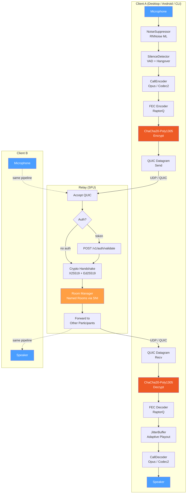
```mermaid
graph TB
    subgraph "Client A (Desktop / Android / CLI)"
        MIC[Microphone] --> DN[NoiseSuppressor<br/>RNNoise ML]
        DN --> SD[SilenceDetector<br/>VAD + Hangover]
        SD --> ENC[CallEncoder<br/>Opus / Codec2]
        ENC --> FEC_E[FEC Encoder<br/>RaptorQ]
        FEC_E --> CRYPT_E[ChaCha20-Poly1305<br/>Encrypt]
        CRYPT_E --> QUIC_S[QUIC Datagram<br/>Send]

        QUIC_R[QUIC Datagram<br/>Recv] --> CRYPT_D[ChaCha20-Poly1305<br/>Decrypt]
        CRYPT_D --> FEC_D[FEC Decoder<br/>RaptorQ]
        FEC_D --> JIT[JitterBuffer<br/>Adaptive Playout]
        JIT --> DEC[CallDecoder<br/>Opus / Codec2]
        DEC --> SPK[Speaker]
    end

    subgraph "Relay (SFU)"
        ACCEPT[Accept QUIC] --> AUTH{Auth?}
        AUTH -->|token| VALIDATE[POST /v1/auth/validate]
        AUTH -->|no auth| HS
        VALIDATE --> HS[Crypto Handshake<br/>X25519 + Ed25519]
        HS --> ROOM[Room Manager<br/>Named Rooms via SNI]
        ROOM --> FWD[Forward to<br/>Other Participants]
    end

    subgraph "Client B"
        B_SPK[Speaker]
        B_MIC[Microphone]
    end

    QUIC_S -->|UDP / QUIC| ACCEPT
    FWD -->|UDP / QUIC| QUIC_R
    B_MIC -.->|same pipeline| ACCEPT
    FWD -.->|same pipeline| B_SPK

    style MIC fill:#4a9eff,color:#fff
    style SPK fill:#4a9eff,color:#fff
    style B_MIC fill:#4a9eff,color:#fff
    style B_SPK fill:#4a9eff,color:#fff
    style ROOM fill:#ff9f43,color:#fff
    style CRYPT_E fill:#ee5a24,color:#fff
    style CRYPT_D fill:#ee5a24,color:#fff
```

## Crate Dependency Graph

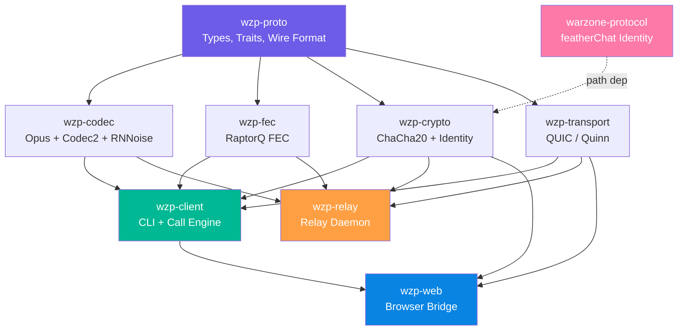
```mermaid
graph TD
    PROTO["wzp-proto<br/>Types, Traits, Wire Format"]

    CODEC["wzp-codec<br/>Opus + Codec2 + RNNoise"]
    FEC["wzp-fec<br/>RaptorQ FEC"]
    CRYPTO["wzp-crypto<br/>ChaCha20 + Identity"]
    TRANSPORT["wzp-transport<br/>QUIC / Quinn"]

    RELAY["wzp-relay<br/>Relay Daemon"]
    CLIENT["wzp-client<br/>CLI + Call Engine"]
    WEB["wzp-web<br/>Browser Bridge"]

    PROTO --> CODEC
    PROTO --> FEC
    PROTO --> CRYPTO
    PROTO --> TRANSPORT

    CODEC --> CLIENT
    FEC --> CLIENT
    CRYPTO --> CLIENT
    TRANSPORT --> CLIENT

    CODEC --> RELAY
    FEC --> RELAY
    CRYPTO --> RELAY
    TRANSPORT --> RELAY

    CLIENT --> WEB
    TRANSPORT --> WEB
    CRYPTO --> WEB

    FC["warzone-protocol<br/>featherChat Identity"] -.->|path dep| CRYPTO

    style PROTO fill:#6c5ce7,color:#fff
    style RELAY fill:#ff9f43,color:#fff
    style CLIENT fill:#00b894,color:#fff
    style WEB fill:#0984e3,color:#fff
    style FC fill:#fd79a8,color:#fff
```

**Star pattern**: Each leaf crate (`wzp-codec`, `wzp-fec`, `wzp-crypto`, `wzp-transport`) depends only on `wzp-proto`. No leaf depends on another leaf. Integration crates (`wzp-relay`, `wzp-client`, `wzp-web`) depend on all leaves.

## Audio Encode Pipeline

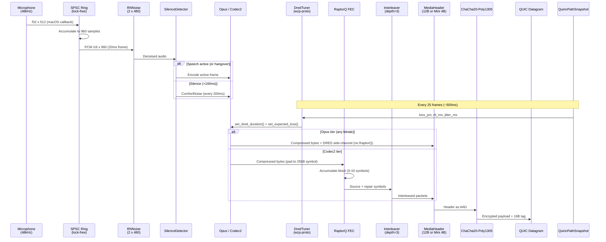
```mermaid
sequenceDiagram
    participant Mic as Microphone<br/>(48kHz)
    participant Ring as SPSC Ring<br/>(lock-free)
    participant RNN as RNNoise<br/>(2 x 480)
    participant VAD as SilenceDetector
    participant Codec as Opus / Codec2
    participant DT as DredTuner<br/>(wzp-proto)
    participant FEC as RaptorQ FEC
    participant INT as Interleaver<br/>(depth=3)
    participant HDR as MediaHeader<br/>(12B or Mini 4B)
    participant Enc as ChaCha20-Poly1305
    participant QUIC as QUIC Datagram
    participant QPS as QuinnPathSnapshot

    Mic->>Ring: f32 x 512 (macOS callback)
    Ring->>Ring: Accumulate to 960 samples
    Ring->>RNN: PCM i16 x 960 (20ms frame)
    RNN->>VAD: Denoised audio
    alt Speech active (or hangover)
        VAD->>Codec: Encode active frame
    else Silence (>100ms)
        VAD->>Codec: ComfortNoise (every 200ms)
    end

    Note over QPS,DT: Every 25 frames (~500ms)
    QPS->>DT: loss_pct, rtt_ms, jitter_ms
    DT->>Codec: set_dred_duration() + set_expected_loss()

    alt Opus tier (any bitrate)
        Codec->>HDR: Compressed bytes + DRED side-channel (no RaptorQ)
    else Codec2 tier
        Codec->>FEC: Compressed bytes (pad to 256B symbol)
        FEC->>FEC: Accumulate block (5-10 symbols)
        FEC->>INT: Source + repair symbols
        INT->>HDR: Interleaved packets
    end
    HDR->>Enc: Header as AAD
    Enc->>QUIC: Encrypted payload + 16B tag
```

### Key Details

- macOS delivers **512 f32** samples per callback (not configurable to 960)
- Ring buffer accumulates to **960 samples** (20ms at 48 kHz) for codec frame
- RNNoise processes **2 x 480** samples (ML-based noise suppression via nnnoiseless)
- Silence detection uses VAD + 100ms hangover before switching to ComfortNoise
- FEC symbols are padded to **256 bytes** with a 2-byte LE length prefix
- MiniHeaders (4 bytes) replace full headers (12 bytes) for 49 of every 50 frames
- DRED tuner polls quinn path stats every 25 frames (~500ms) and adjusts DRED lookback duration continuously
- Opus tiers bypass RaptorQ entirely -- DRED handles loss recovery at the codec layer
- Opus6k DRED window: 1040ms (maximum libopus allows)

## Audio Decode Pipeline

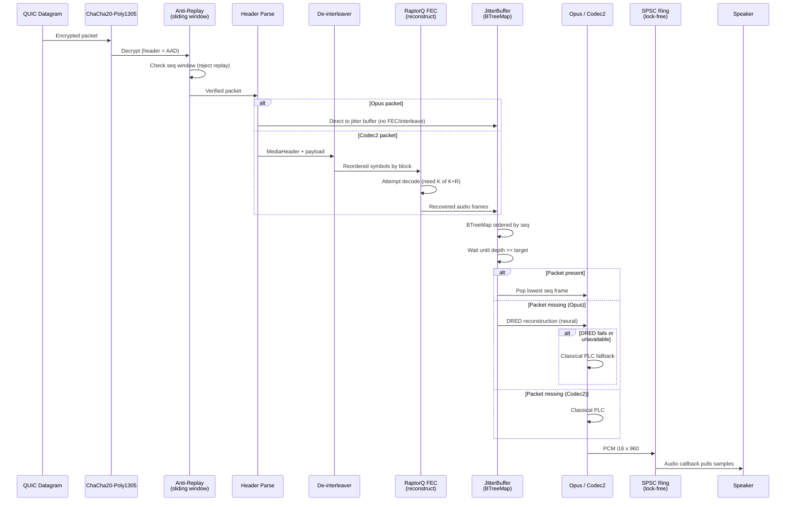
```mermaid
sequenceDiagram
    participant QUIC as QUIC Datagram
    participant Dec as ChaCha20-Poly1305
    participant AR as Anti-Replay<br/>(sliding window)
    participant HDR as Header Parse
    participant DEINT as De-interleaver
    participant FEC as RaptorQ FEC<br/>(reconstruct)
    participant JIT as JitterBuffer<br/>(BTreeMap)
    participant Codec as Opus / Codec2
    participant Ring as SPSC Ring<br/>(lock-free)
    participant SPK as Speaker

    QUIC->>Dec: Encrypted packet
    Dec->>AR: Decrypt (header = AAD)
    AR->>AR: Check seq window (reject replay)
    AR->>HDR: Verified packet

    alt Opus packet
        HDR->>JIT: Direct to jitter buffer (no FEC/interleave)
    else Codec2 packet
        HDR->>DEINT: MediaHeader + payload
        DEINT->>FEC: Reordered symbols by block
        FEC->>FEC: Attempt decode (need K of K+R)
        FEC->>JIT: Recovered audio frames
    end

    JIT->>JIT: BTreeMap ordered by seq
    JIT->>JIT: Wait until depth >= target

    alt Packet present
        JIT->>Codec: Pop lowest seq frame
    else Packet missing (Opus)
        JIT->>Codec: DRED reconstruction (neural)
        alt DRED fails or unavailable
            Codec->>Codec: Classical PLC fallback
        end
    else Packet missing (Codec2)
        Codec->>Codec: Classical PLC
    end

    Codec->>Ring: PCM i16 x 960
    Ring->>SPK: Audio callback pulls samples
```

### Key Details

- Anti-replay uses a **64-packet sliding window** to reject duplicates
- FEC decoder needs any **K of K+R** symbols to reconstruct a block
- Jitter buffer target: **10 packets (200ms)** for client, **50 packets (1s)** for relay
- Desktop client uses **direct playout** (no jitter buffer) with lock-free ring
- Codec2 frames at 8 kHz are resampled to 48 kHz transparently
- DRED reconstruction: on packet loss, decoder tries neural DRED reconstruction before falling back to classical PLC
- Jitter-spike detection pre-emptively boosts DRED to ceiling when jitter variance spikes >30%

## Relay SFU Forwarding

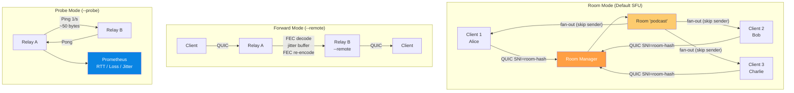
```mermaid
graph TB
    subgraph "Room Mode (Default SFU)"
        C1[Client 1<br/>Alice] -->|"QUIC SNI=room-hash"| RM[Room Manager]
        C2[Client 2<br/>Bob] -->|"QUIC SNI=room-hash"| RM
        C3[Client 3<br/>Charlie] -->|"QUIC SNI=room-hash"| RM
        RM --> R1["Room 'podcast'"]
        R1 -->|"fan-out (skip sender)"| C1
        R1 -->|"fan-out (skip sender)"| C2
        R1 -->|"fan-out (skip sender)"| C3
    end

    subgraph "Forward Mode (--remote)"
        C4[Client] -->|QUIC| RA[Relay A]
        RA -->|"FEC decode<br/>jitter buffer<br/>FEC re-encode"| RB[Relay B<br/>--remote]
        RB -->|QUIC| C5[Client]
    end

    subgraph "Probe Mode (--probe)"
        PA[Relay A] -->|"Ping 1/s<br/>~50 bytes"| PB[Relay B]
        PB -->|Pong| PA
        PA --> PM[Prometheus<br/>RTT / Loss / Jitter]
    end

    style RM fill:#ff9f43,color:#fff
    style R1 fill:#fdcb6e
    style PM fill:#0984e3,color:#fff
```

### SFU Fan-out Rules

1. Each incoming datagram is forwarded to all other participants in the room
2. The sender is excluded from fan-out (no echo)
3. If one send fails, the relay continues to the next participant (best-effort)
4. The relay never decodes or re-encodes audio (preserves E2E encryption)
5. With trunking enabled, packets to the same receiver are batched into TrunkFrames (flushed every 5ms)
6. Relay tracks per-participant quality from QualityReport trailers and broadcasts `QualityDirective` when the room-wide tier degrades (coordinated codec switching)

## Federation Topology

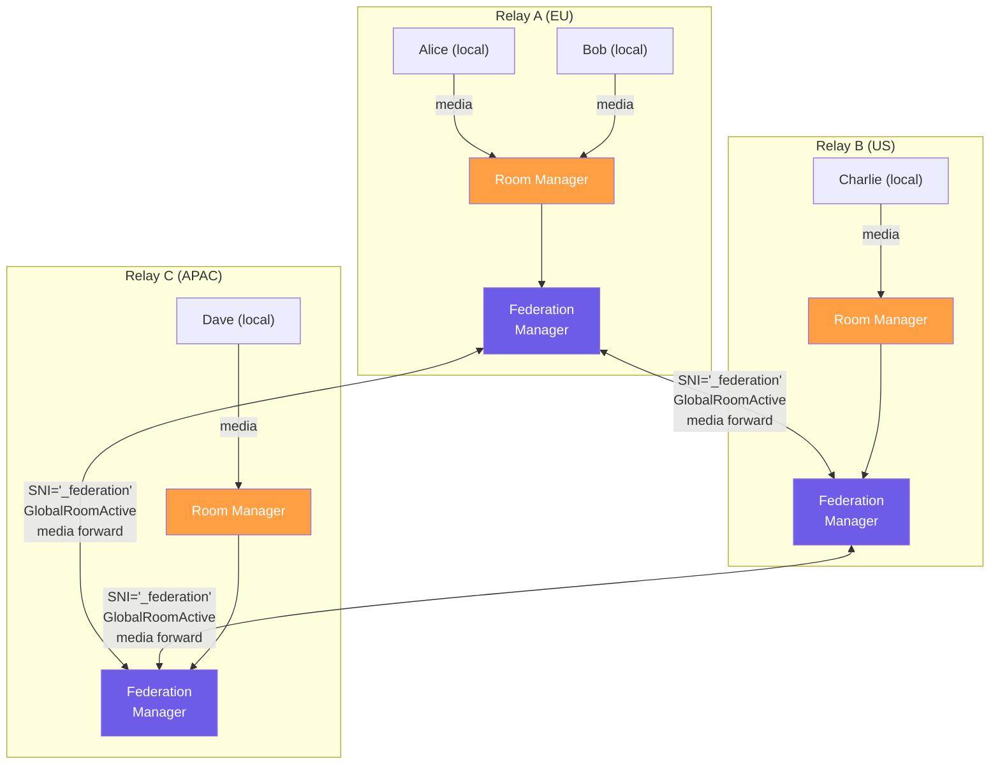
```mermaid
graph TB
    subgraph "Relay A (EU)"
        A_R["Room Manager"]
        A_F["Federation<br/>Manager"]
        A1["Alice (local)"]
        A2["Bob (local)"]
    end

    subgraph "Relay B (US)"
        B_R["Room Manager"]
        B_F["Federation<br/>Manager"]
        B1["Charlie (local)"]
    end

    subgraph "Relay C (APAC)"
        C_R["Room Manager"]
        C_F["Federation<br/>Manager"]
        C1["Dave (local)"]
    end

    A1 -->|media| A_R
    A2 -->|media| A_R
    B1 -->|media| B_R
    C1 -->|media| C_R

    A_F <-->|"SNI='_federation'<br/>GlobalRoomActive<br/>media forward"| B_F
    A_F <-->|"SNI='_federation'<br/>GlobalRoomActive<br/>media forward"| C_F
    B_F <-->|"SNI='_federation'<br/>GlobalRoomActive<br/>media forward"| C_F

    A_R --> A_F
    B_R --> B_F
    C_R --> C_F

    style A_F fill:#6c5ce7,color:#fff
    style B_F fill:#6c5ce7,color:#fff
    style C_F fill:#6c5ce7,color:#fff
    style A_R fill:#ff9f43,color:#fff
    style B_R fill:#ff9f43,color:#fff
    style C_R fill:#ff9f43,color:#fff
```

### Federation Protocol Flow

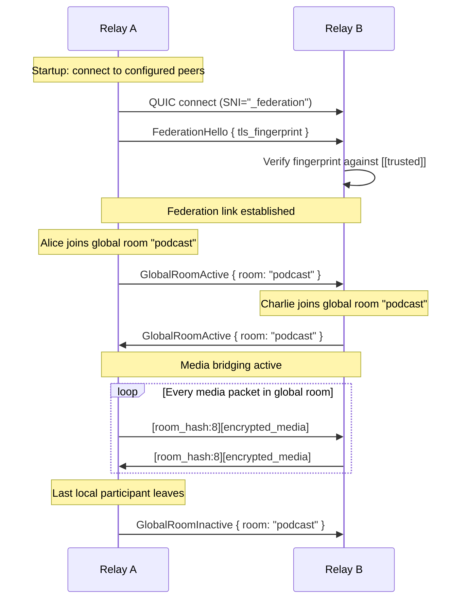
```mermaid
sequenceDiagram
    participant RA as Relay A
    participant RB as Relay B

    Note over RA: Startup: connect to configured peers

    RA->>RB: QUIC connect (SNI="_federation")
    RA->>RB: FederationHello { tls_fingerprint }
    RB->>RB: Verify fingerprint against [[trusted]]

    Note over RA,RB: Federation link established

    Note over RA: Alice joins global room "podcast"
    RA->>RB: GlobalRoomActive { room: "podcast" }

    Note over RB: Charlie joins global room "podcast"
    RB->>RA: GlobalRoomActive { room: "podcast" }

    Note over RA,RB: Media bridging active

    loop Every media packet in global room
        RA->>RB: [room_hash:8][encrypted_media]
        RB->>RA: [room_hash:8][encrypted_media]
    end

    Note over RA: Last local participant leaves
    RA->>RB: GlobalRoomInactive { room: "podcast" }
```

## Wire Formats

### MediaHeader (12 bytes)

```
Byte 0:  [V:1][T:1][CodecID:4][Q:1][FecRatioHi:1]
Byte 1:  [FecRatioLo:6][unused:2]
Bytes 2-3:  sequence (u16 BE)
Bytes 4-7:  timestamp_ms (u32 BE)
Byte 8:     fec_block_id (u8)
Byte 9:     fec_symbol_idx (u8)
Byte 10:    reserved
Byte 11:    csrc_count
```

| Field | Bits | Description |
|-------|------|-------------|
| V (version) | 1 | Protocol version (0 = v1) |
| T (is_repair) | 1 | 1 = FEC repair packet, 0 = source media |
| CodecID | 4 | Codec identifier (0-8, see table below) |
| Q | 1 | 1 = QualityReport trailer appended |
| FecRatio | 7 | FEC ratio encoded as 0-127 mapping to 0.0-2.0 |
| sequence | 16 | Wrapping packet sequence number |
| timestamp_ms | 32 | Milliseconds since session start |
| fec_block_id | 8 | FEC source block ID (wrapping) |
| fec_symbol_idx | 8 | Symbol index within FEC block |
| reserved | 8 | Reserved flags |
| csrc_count | 8 | Contributing source count (future mixing) |

#### CodecID Values

| Value | Codec | Bitrate | Sample Rate | Frame Duration |
|-------|-------|---------|-------------|---------------|
| 0 | Opus 24k | 24 kbps | 48 kHz | 20ms |
| 1 | Opus 16k | 16 kbps | 48 kHz | 20ms |
| 2 | Opus 6k | 6 kbps | 48 kHz | 40ms |
| 3 | Codec2 3200 | 3.2 kbps | 8 kHz | 20ms |
| 4 | Codec2 1200 | 1.2 kbps | 8 kHz | 40ms |
| 5 | ComfortNoise | 0 | 48 kHz | 20ms |
| 6 | Opus 32k | 32 kbps | 48 kHz | 20ms |
| 7 | Opus 48k | 48 kbps | 48 kHz | 20ms |
| 8 | Opus 64k | 64 kbps | 48 kHz | 20ms |

### MiniHeader (4 bytes, compressed)

```
[FRAME_TYPE_MINI: 0x01]
Bytes 0-1: timestamp_delta_ms (u16 BE)
Bytes 2-3: payload_len (u16 BE)
```

Used for 49 of every 50 frames (~1s cycle). Saves 8 bytes per packet (67% header reduction). Full header is sent every 50th frame to resynchronize state.

### TrunkFrame (batched datagrams)

```
[count: u16]
  [session_id: 2][len: u16][payload: len]  x count
```

Packs multiple session packets into one QUIC datagram. Maximum 10 entries or PMTUD-discovered MTU (starts at 1200, grows to ~1452 on Ethernet), flushed every 5ms.

### QualityReport (4 bytes, optional trailer)

```
Byte 0: loss_pct    (0-255 maps to 0-100%)
Byte 1: rtt_4ms     (0-255 maps to 0-1020ms, resolution 4ms)
Byte 2: jitter_ms   (0-255ms)
Byte 3: bitrate_cap_kbps (0-255 kbps)
```

Appended to a media packet when the Q flag is set in the MediaHeader.

## Path MTU Discovery

Quinn's PLPMTUD is enabled with:
- `initial_mtu`: 1200 bytes (QUIC minimum, always safe)
- `upper_bound`: 1452 bytes (Ethernet minus IP/UDP/QUIC headers)
- `interval`: 300s (re-probe every 5 minutes)
- `black_hole_cooldown`: 30s (faster retry on lossy links)

The discovered MTU is exposed via `QuinnPathSnapshot::current_mtu` and used by:
- `TrunkedForwarder`: refreshes `max_bytes` on every send to fill larger datagrams
- Future video framer: larger MTU = fewer application-layer fragments per frame

## Continuous DRED Tuning

Instead of locking DRED duration to 3 discrete quality tiers, the `DredTuner` (in `wzp-proto::dred_tuner`) maps live path quality to a continuous DRED duration:

| Input | Source | Update Rate |
|-------|--------|-------------|
| Loss % | `QuinnPathSnapshot::loss_pct` (from quinn ACK frames) | Every 25 packets (~500ms) |
| RTT ms | `QuinnPathSnapshot::rtt_ms` (quinn congestion controller) | Every 25 packets |
| Jitter ms | `PathMonitor::jitter_ms` (EWMA of RTT variance) | Every 25 packets |

### Mapping Logic

- **Baseline**: codec-tier default (Studio=100ms, Good=200ms, Degraded=500ms)
- **Ceiling**: codec-tier max (Studio=300ms, Good=500ms, Degraded=1040ms)
- **Continuous**: linear interpolation between baseline and ceiling based on loss (0%->baseline, 40%->ceiling)
- **RTT phantom loss**: high RTT (>200ms) adds phantom loss contribution to keep DRED generous
- **Jitter spike**: >30% EWMA spike pre-emptively boosts to ceiling for ~5s cooldown

### Output

`DredTuning { dred_frames: u8, expected_loss_pct: u8 }` -> fed to `CallEncoder::apply_dred_tuning()` -> `OpusEncoder::set_dred_duration()` + `set_expected_loss()`

## Signal Message Handshake Flow

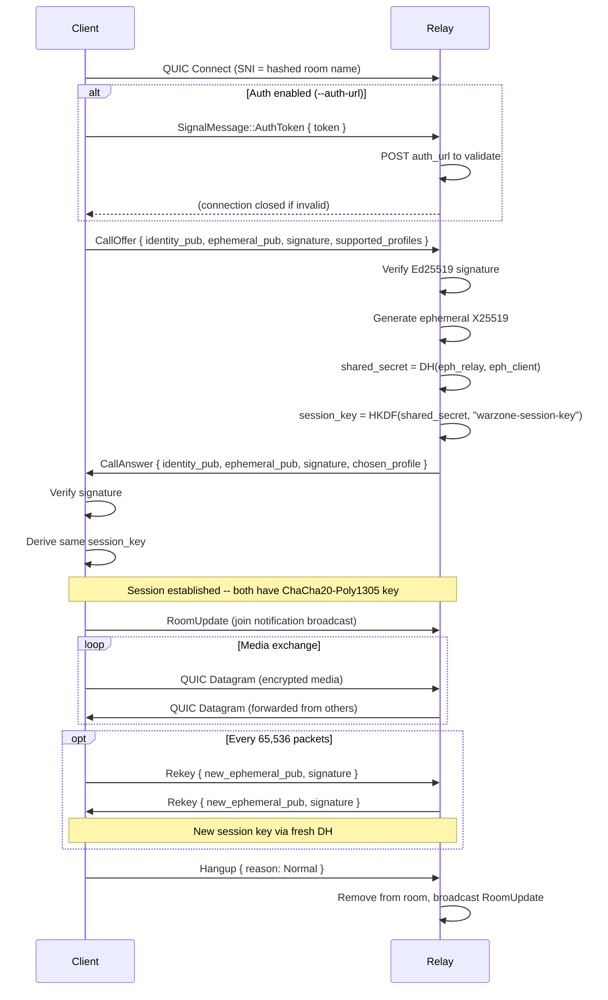
```mermaid
sequenceDiagram
    participant C as Client
    participant R as Relay

    C->>R: QUIC Connect (SNI = hashed room name)

    alt Auth enabled (--auth-url)
        C->>R: SignalMessage::AuthToken { token }
        R->>R: POST auth_url to validate
        R-->>C: (connection closed if invalid)
    end

    C->>R: CallOffer { identity_pub, ephemeral_pub, signature, supported_profiles }
    R->>R: Verify Ed25519 signature
    R->>R: Generate ephemeral X25519
    R->>R: shared_secret = DH(eph_relay, eph_client)
    R->>R: session_key = HKDF(shared_secret, "warzone-session-key")
    R->>C: CallAnswer { identity_pub, ephemeral_pub, signature, chosen_profile }

    C->>C: Verify signature
    C->>C: Derive same session_key

    Note over C,R: Session established -- both have ChaCha20-Poly1305 key

    C->>R: RoomUpdate (join notification broadcast)

    loop Media exchange
        C->>R: QUIC Datagram (encrypted media)
        R->>C: QUIC Datagram (forwarded from others)
    end

    opt Every 65,536 packets
        C->>R: Rekey { new_ephemeral_pub, signature }
        R->>C: Rekey { new_ephemeral_pub, signature }
        Note over C,R: New session key via fresh DH
    end

    C->>R: Hangup { reason: Normal }
    R->>R: Remove from room, broadcast RoomUpdate
```

## Relay Concurrency Model

### Threading
- Multi-threaded Tokio runtime (all available cores, work-stealing scheduler)
- Task-per-connection: each QUIC connection gets a dedicated `tokio::spawn`
- Task-per-participant-per-room: each participant's media forwarding loop is independent

### Shared State & Locking

| Lock | Protected Data | Hold Duration | Contention |
|------|---------------|---------------|------------|
| `RoomManager` (Mutex) | Rooms, participants, quality tiers | ~1ms/packet | O(N) per room |
| `PresenceRegistry` (Mutex) | Fingerprint registrations | ~1ms | Low (join/leave only) |
| `SessionManager` (Mutex) | Active session tracking | ~1ms | Low |
| `FederationManager.peer_links` (Mutex) | Peer connections | ~10ms during forward | Per-federation-packet |

### Scaling Characteristics

- **Many small rooms**: Scales well across all cores (rooms are independent)
- **Large single room (100+ participants)**: Serialized by RoomManager lock
- **Federation**: Per-peer tasks scale; `peer_links` lock held during send loop

### Primary Bottleneck

The RoomManager Mutex is acquired per-packet by every participant to get the fan-out peer list. Lock is released before I/O (sends happen outside lock), but packet processing is serialized through the lock within a room.

Future optimization: per-room locks or lock-free participant lists via `DashMap`.

## Client Architecture

### Desktop Engine (Tauri)

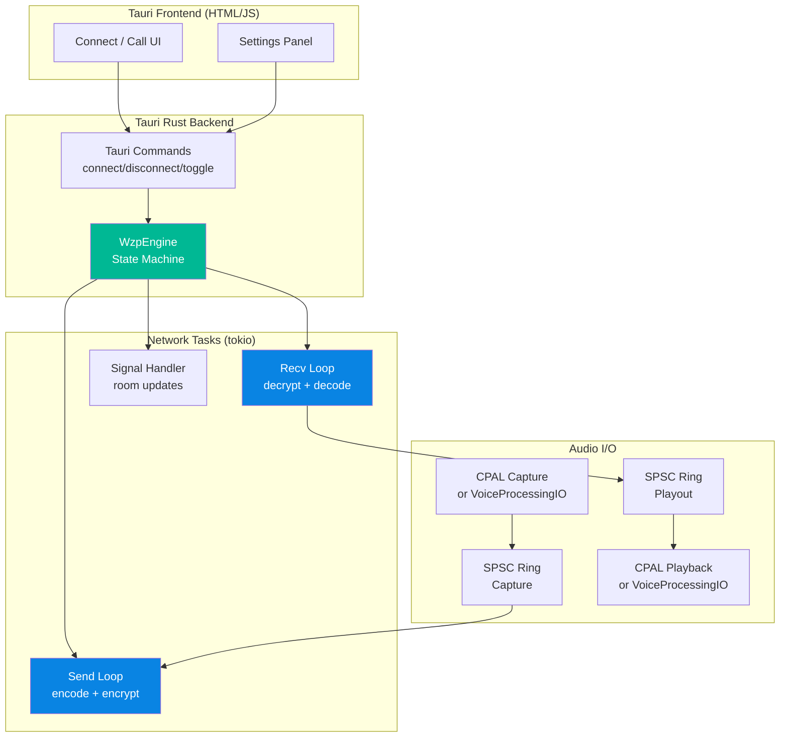
```mermaid
graph TB
    subgraph "Tauri Frontend (HTML/JS)"
        UI[Connect / Call UI]
        SET[Settings Panel]
    end

    subgraph "Tauri Rust Backend"
        CMD[Tauri Commands<br/>connect/disconnect/toggle]
        ENG[WzpEngine<br/>State Machine]
    end

    subgraph "Audio I/O"
        CPAL_C[CPAL Capture<br/>or VoiceProcessingIO]
        RING_C[SPSC Ring<br/>Capture]
        RING_P[SPSC Ring<br/>Playout]
        CPAL_P[CPAL Playback<br/>or VoiceProcessingIO]
    end

    subgraph "Network Tasks (tokio)"
        SEND[Send Loop<br/>encode + encrypt]
        RECV[Recv Loop<br/>decrypt + decode]
        SIG[Signal Handler<br/>room updates]
    end

    UI --> CMD
    SET --> CMD
    CMD --> ENG
    ENG --> SEND
    ENG --> RECV
    ENG --> SIG

    CPAL_C --> RING_C --> SEND
    RECV --> RING_P --> CPAL_P

    style ENG fill:#00b894,color:#fff
    style SEND fill:#0984e3,color:#fff
    style RECV fill:#0984e3,color:#fff
```

Key design decisions:
- **Lock-free SPSC rings** between audio callbacks and network tasks (no mutex on audio thread)
- **VoiceProcessingIO** on macOS for OS-level AEC (CPAL uses HalOutput which has no AEC)
- **Direct playout** -- no jitter buffer on client; audio callback pulls from ring
- **Release builds required** -- debug builds too slow for real-time audio

### Android Engine (Kotlin + JNI)

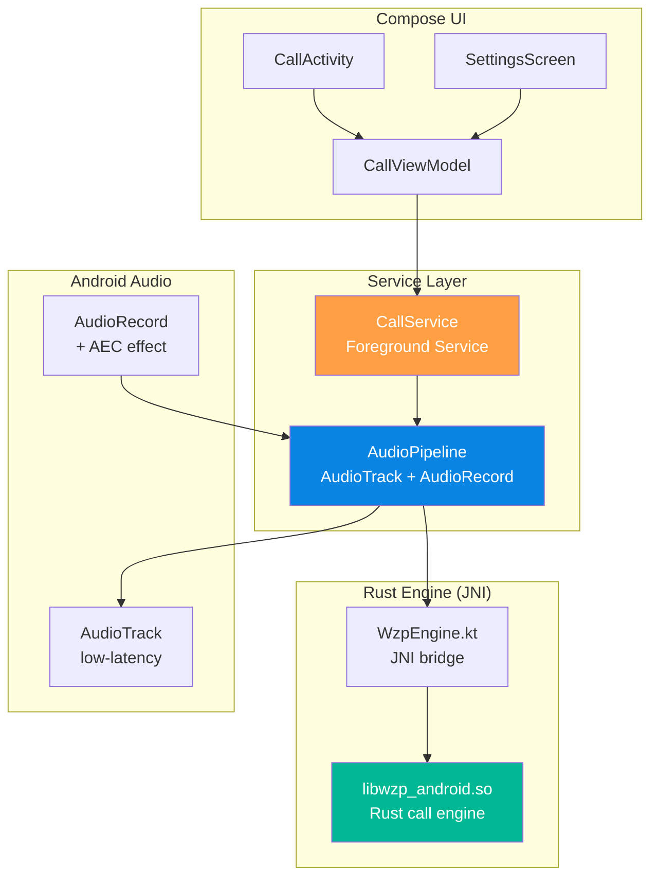
```mermaid
graph TB
    subgraph "Compose UI"
        CALL[CallActivity]
        SET[SettingsScreen]
        VM[CallViewModel]
    end

    subgraph "Service Layer"
        SVC[CallService<br/>Foreground Service]
        PIPE[AudioPipeline<br/>AudioTrack + AudioRecord]
    end

    subgraph "Rust Engine (JNI)"
        JNI[WzpEngine.kt<br/>JNI bridge]
        NATIVE[libwzp_android.so<br/>Rust call engine]
    end

    subgraph "Android Audio"
        REC[AudioRecord<br/>+ AEC effect]
        TRK[AudioTrack<br/>low-latency]
    end

    CALL --> VM
    SET --> VM
    VM --> SVC
    SVC --> PIPE
    PIPE --> JNI
    JNI --> NATIVE

    REC --> PIPE
    PIPE --> TRK

    style NATIVE fill:#00b894,color:#fff
    style SVC fill:#ff9f43,color:#fff
    style PIPE fill:#0984e3,color:#fff
```

Key design decisions:
- **Foreground service** keeps audio alive when the screen is off
- **AudioRecord + AudioTrack** with Android's built-in AEC (AudioEffect)
- **Lock-free AudioRing** with preallocated Vec (not push/pop) to avoid allocation on audio thread
- **JNI bridge** marshals PCM frames between Kotlin and Rust

### CLI Architecture

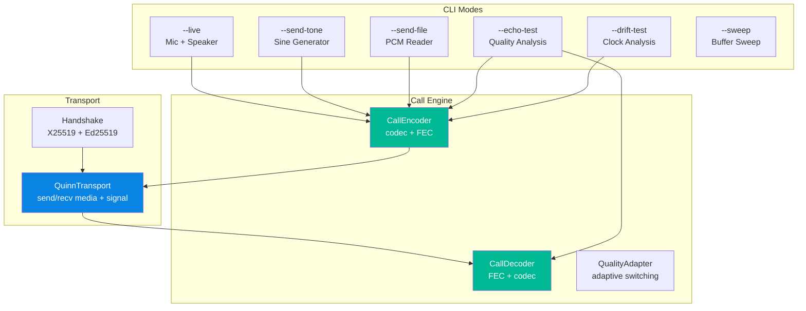
```mermaid
graph TB
    subgraph "CLI Modes"
        LIVE[--live<br/>Mic + Speaker]
        TONE[--send-tone<br/>Sine Generator]
        FILE[--send-file<br/>PCM Reader]
        ECHO[--echo-test<br/>Quality Analysis]
        DRIFT[--drift-test<br/>Clock Analysis]
        SWEEP[--sweep<br/>Buffer Sweep]
    end

    subgraph "Call Engine"
        ENCODE[CallEncoder<br/>codec + FEC]
        DECODE[CallDecoder<br/>FEC + codec]
        QA[QualityAdapter<br/>adaptive switching]
    end

    subgraph "Transport"
        QUIC[QuinnTransport<br/>send/recv media + signal]
        HS[Handshake<br/>X25519 + Ed25519]
    end

    LIVE --> ENCODE
    TONE --> ENCODE
    FILE --> ENCODE
    ENCODE --> QUIC
    QUIC --> DECODE
    ECHO --> ENCODE
    ECHO --> DECODE
    DRIFT --> ENCODE
    HS --> QUIC

    style ENCODE fill:#00b894,color:#fff
    style DECODE fill:#00b894,color:#fff
    style QUIC fill:#0984e3,color:#fff
```

## Adaptive Quality System


```mermaid
graph LR
    subgraph GOOD ["GOOD (28.8 kbps)"]
        G_C[Opus 24kbps]
        G_F[FEC 20%]
        G_FR[20ms frames]
    end

    subgraph DEGRADED ["DEGRADED (9.0 kbps)"]
        D_C[Opus 6kbps]
        D_F[FEC 50%]
        D_FR[40ms frames]
    end

    subgraph CATASTROPHIC ["CATASTROPHIC (2.4 kbps)"]
        C_C[Codec2 1200bps]
        C_F[FEC 100%]
        C_FR[40ms frames]
    end

    GOOD -->|"loss>10% or RTT>400ms<br/>3 consecutive reports"| DEGRADED
    DEGRADED -->|"loss>40% or RTT>600ms<br/>3 consecutive"| CATASTROPHIC
    CATASTROPHIC -->|"loss<10% and RTT<400ms<br/>10 consecutive"| DEGRADED
    DEGRADED -->|"loss<10% and RTT<400ms<br/>10 consecutive"| GOOD

    style GOOD fill:#00b894,color:#fff
    style DEGRADED fill:#fdcb6e
    style CATASTROPHIC fill:#e17055,color:#fff
```

Hysteresis prevents tier flapping: **fast downgrade** (3 reports, or 2 on cellular) and **slow upgrade** (10 reports, one tier at a time).

## Cryptographic Handshake

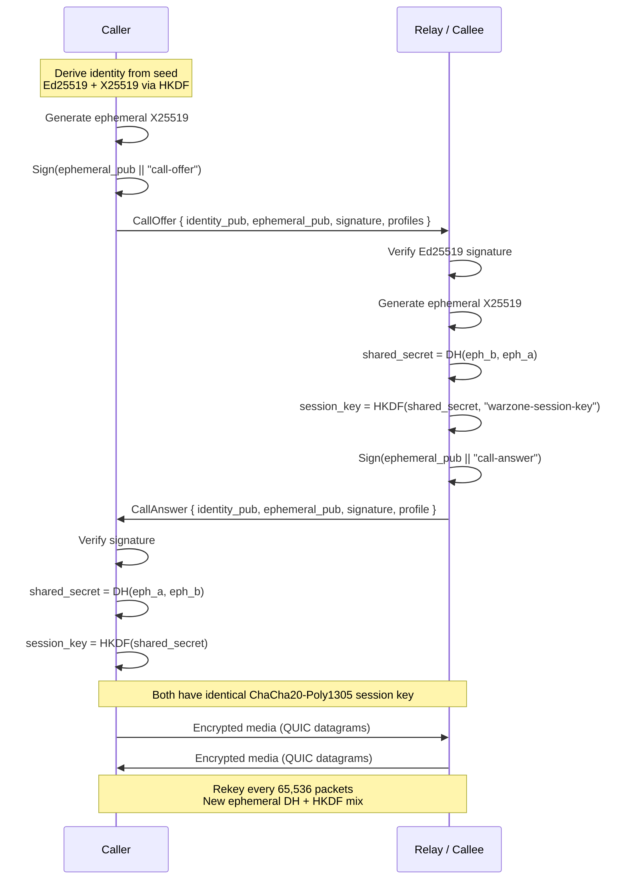
```mermaid
sequenceDiagram
    participant C as Caller
    participant R as Relay / Callee

    Note over C: Derive identity from seed<br/>Ed25519 + X25519 via HKDF

    C->>C: Generate ephemeral X25519
    C->>C: Sign(ephemeral_pub || "call-offer")
    C->>R: CallOffer { identity_pub, ephemeral_pub, signature, profiles }

    R->>R: Verify Ed25519 signature
    R->>R: Generate ephemeral X25519
    R->>R: shared_secret = DH(eph_b, eph_a)
    R->>R: session_key = HKDF(shared_secret, "warzone-session-key")
    R->>R: Sign(ephemeral_pub || "call-answer")
    R->>C: CallAnswer { identity_pub, ephemeral_pub, signature, profile }

    C->>C: Verify signature
    C->>C: shared_secret = DH(eph_a, eph_b)
    C->>C: session_key = HKDF(shared_secret)

    Note over C,R: Both have identical ChaCha20-Poly1305 session key
    C->>R: Encrypted media (QUIC datagrams)
    R->>C: Encrypted media (QUIC datagrams)

    Note over C,R: Rekey every 65,536 packets<br/>New ephemeral DH + HKDF mix
```

## Identity Model

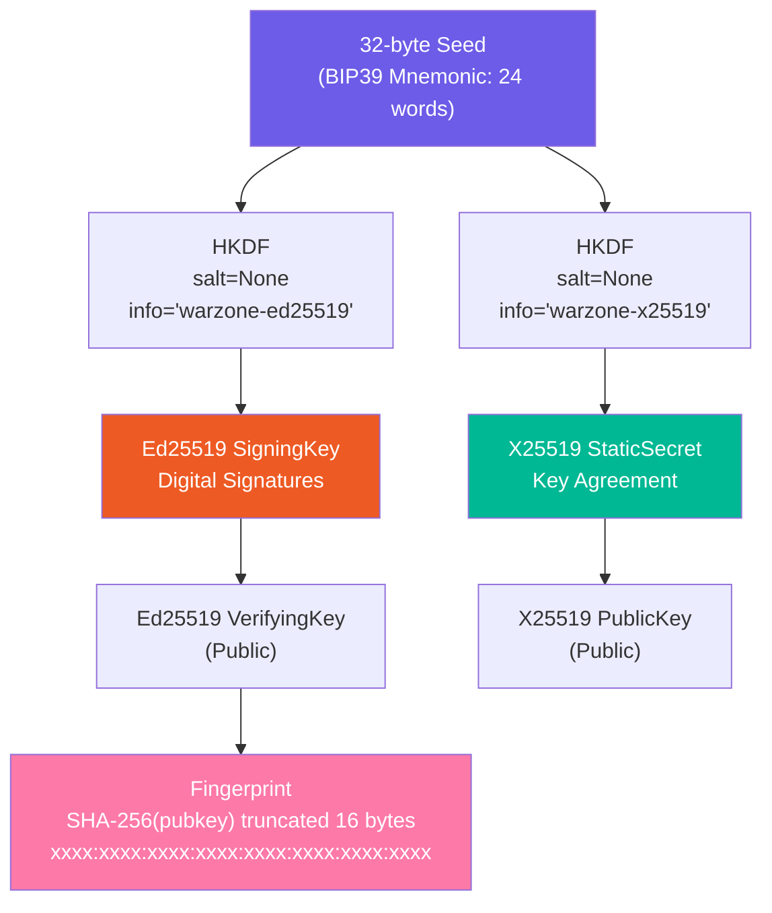
```mermaid
graph TD
    SEED["32-byte Seed<br/>(BIP39 Mnemonic: 24 words)"] --> HKDF1["HKDF<br/>salt=None<br/>info='warzone-ed25519'"]
    SEED --> HKDF2["HKDF<br/>salt=None<br/>info='warzone-x25519'"]

    HKDF1 --> ED["Ed25519 SigningKey<br/>Digital Signatures"]
    HKDF2 --> X25519["X25519 StaticSecret<br/>Key Agreement"]

    ED --> VKEY["Ed25519 VerifyingKey<br/>(Public)"]
    X25519 --> XPUB["X25519 PublicKey<br/>(Public)"]

    VKEY --> FP["Fingerprint<br/>SHA-256(pubkey) truncated 16 bytes<br/>xxxx:xxxx:xxxx:xxxx:xxxx:xxxx:xxxx:xxxx"]

    style SEED fill:#6c5ce7,color:#fff
    style FP fill:#fd79a8,color:#fff
    style ED fill:#ee5a24,color:#fff
    style X25519 fill:#00b894,color:#fff
```

## Adaptive Jitter Buffer

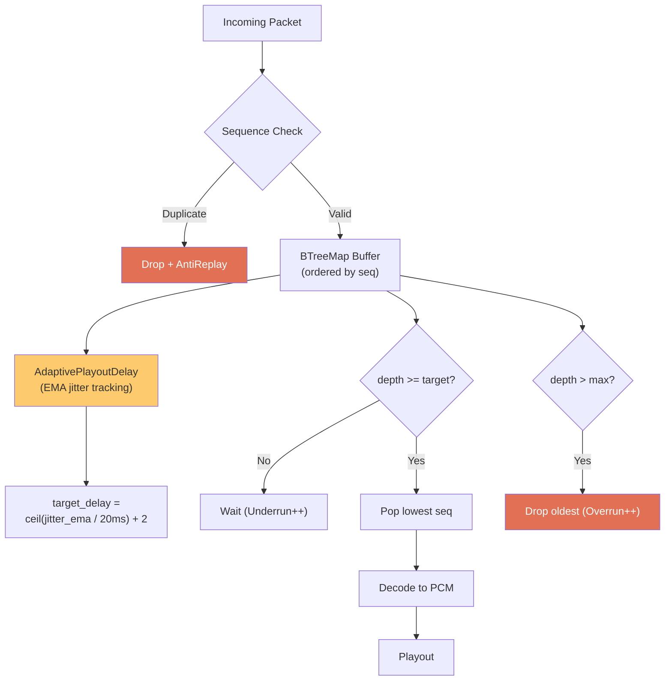
```mermaid
graph TD
    PKT[Incoming Packet] --> SEQ{Sequence Check}
    SEQ -->|Duplicate| DROP[Drop + AntiReplay]
    SEQ -->|Valid| BUF["BTreeMap Buffer<br/>(ordered by seq)"]

    BUF --> ADAPT["AdaptivePlayoutDelay<br/>(EMA jitter tracking)"]
    ADAPT --> TARGET["target_delay =<br/>ceil(jitter_ema / 20ms) + 2"]

    BUF --> READY{"depth >= target?"}
    READY -->|No| WAIT["Wait (Underrun++)"]
    READY -->|Yes| POP[Pop lowest seq]
    POP --> DECODE[Decode to PCM]
    DECODE --> PLAY[Playout]

    BUF --> OVERFLOW{"depth > max?"}
    OVERFLOW -->|Yes| EVICT["Drop oldest (Overrun++)"]

    style ADAPT fill:#fdcb6e
    style DROP fill:#e17055,color:#fff
    style EVICT fill:#e17055,color:#fff
```

## FEC Protection (RaptorQ)

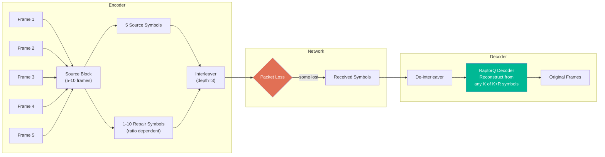
```mermaid
graph LR
    subgraph "Encoder"
        F1[Frame 1] --> BLK["Source Block<br/>(5-10 frames)"]
        F2[Frame 2] --> BLK
        F3[Frame 3] --> BLK
        F4[Frame 4] --> BLK
        F5[Frame 5] --> BLK
        BLK --> SRC[5 Source Symbols]
        BLK --> REP["1-10 Repair Symbols<br/>(ratio dependent)"]
        SRC --> INT["Interleaver<br/>(depth=3)"]
        REP --> INT
    end

    subgraph "Network"
        INT --> LOSS{Packet Loss}
        LOSS -->|some lost| RCV[Received Symbols]
    end

    subgraph "Decoder"
        RCV --> DEINT[De-interleaver]
        DEINT --> RAPTORQ["RaptorQ Decoder<br/>Reconstruct from<br/>any K of K+R symbols"]
        RAPTORQ --> OUT[Original Frames]
    end

    style LOSS fill:#e17055,color:#fff
    style RAPTORQ fill:#00b894,color:#fff
```

## Telemetry Stack

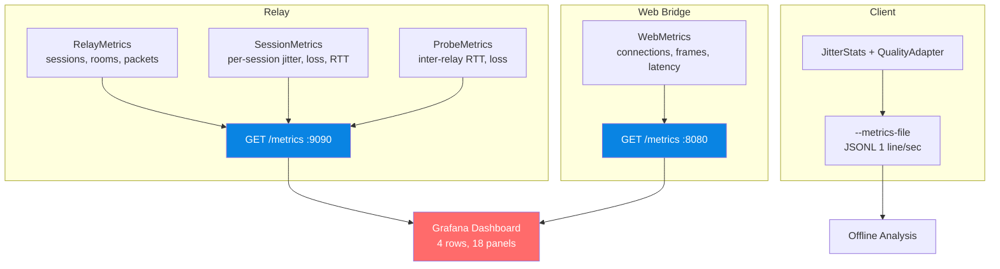
```mermaid
graph TB
    subgraph "Relay"
        RM["RelayMetrics<br/>sessions, rooms, packets"]
        SM["SessionMetrics<br/>per-session jitter, loss, RTT"]
        PM["ProbeMetrics<br/>inter-relay RTT, loss"]
        RM --> PROM1["GET /metrics :9090"]
        SM --> PROM1
        PM --> PROM1
    end

    subgraph "Web Bridge"
        WM["WebMetrics<br/>connections, frames, latency"]
        WM --> PROM2["GET /metrics :8080"]
    end

    subgraph "Client"
        CM["JitterStats + QualityAdapter"]
        CM --> JSONL["--metrics-file<br/>JSONL 1 line/sec"]
    end

    PROM1 --> GRAF["Grafana Dashboard<br/>4 rows, 18 panels"]
    PROM2 --> GRAF
    JSONL --> ANALYSIS[Offline Analysis]

    style GRAF fill:#ff6b6b,color:#fff
    style PROM1 fill:#0984e3,color:#fff
    style PROM2 fill:#0984e3,color:#fff
```

## Deployment Topology

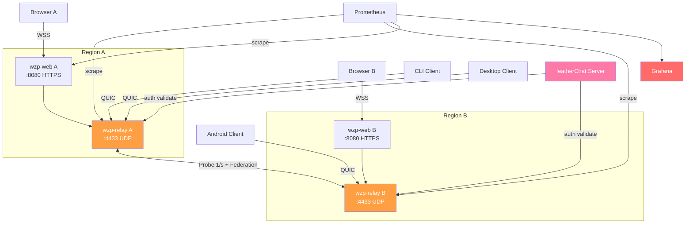
```mermaid
graph TB
    subgraph "Region A"
        RA["wzp-relay A<br/>:4433 UDP"]
        WA["wzp-web A<br/>:8080 HTTPS"]
        WA --> RA
    end

    subgraph "Region B"
        RB["wzp-relay B<br/>:4433 UDP"]
        WB["wzp-web B<br/>:8080 HTTPS"]
        WB --> RB
    end

    RA <-->|"Probe 1/s + Federation"| RB

    BA[Browser A] -->|WSS| WA
    BB[Browser B] -->|WSS| WB
    CA[CLI Client] -->|QUIC| RA
    DA[Desktop Client] -->|QUIC| RA
    MA[Android Client] -->|QUIC| RB

    PROM[Prometheus] -->|scrape| RA
    PROM -->|scrape| RB
    PROM -->|scrape| WA
    PROM --> GRAF[Grafana]

    FC[featherChat Server] -->|auth validate| RA
    FC -->|auth validate| RB

    style RA fill:#ff9f43,color:#fff
    style RB fill:#ff9f43,color:#fff
    style GRAF fill:#ff6b6b,color:#fff
    style FC fill:#fd79a8,color:#fff
```

## Session State Machine

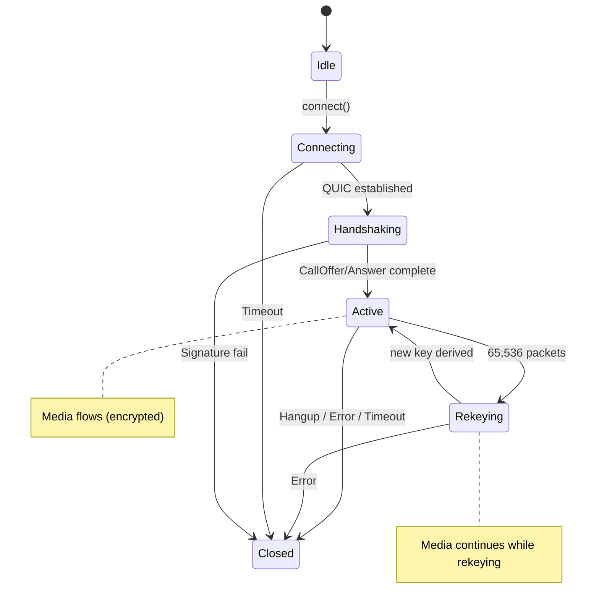
```mermaid
stateDiagram-v2
    [*] --> Idle
    Idle --> Connecting: connect()
    Connecting --> Handshaking: QUIC established
    Handshaking --> Active: CallOffer/Answer complete
    Active --> Rekeying: 65,536 packets
    Rekeying --> Active: new key derived
    Active --> Closed: Hangup / Error / Timeout
    Rekeying --> Closed: Error
    Connecting --> Closed: Timeout
    Handshaking --> Closed: Signature fail

    note right of Active: Media flows (encrypted)
    note right of Rekeying: Media continues while rekeying
```

## Project Structure

```
warzonePhone/
├── Cargo.toml                    # Workspace root
├── crates/
│   ├── wzp-proto/                # Protocol types, traits, wire format
│   │   └── src/
│   │       ├── codec_id.rs       # CodecId, QualityProfile
│   │       ├── error.rs          # Error types
│   │       ├── jitter.rs         # JitterBuffer, AdaptivePlayoutDelay
│   │       ├── packet.rs         # MediaHeader, MiniHeader, TrunkFrame, SignalMessage
│   │       ├── quality.rs        # Tier, AdaptiveQualityController
│   │       ├── session.rs        # SessionState machine
│   │       └── traits.rs         # AudioEncoder, FecEncoder, CryptoSession, etc.
│   ├── wzp-codec/                # Audio codecs
│   │   └── src/
│   │       ├── adaptive.rs       # AdaptiveEncoder/Decoder (Opus + Codec2)
│   │       ├── denoise.rs        # NoiseSuppressor (RNNoise / nnnoiseless)
│   │       └── silence.rs        # SilenceDetector, ComfortNoise
│   ├── wzp-fec/                  # Forward error correction
│   │   └── src/
│   │       ├── encoder.rs        # RaptorQFecEncoder
│   │       ├── decoder.rs        # RaptorQFecDecoder
│   │       └── interleave.rs     # Interleaver (burst protection)
│   ├── wzp-crypto/               # Cryptography + identity
│   │   └── src/
│   │       ├── identity.rs       # Seed, Fingerprint, hash_room_name
│   │       ├── handshake.rs      # WarzoneKeyExchange (X25519 + Ed25519)
│   │       ├── session.rs        # ChaChaSession (ChaCha20-Poly1305)
│   │       ├── nonce.rs          # Deterministic nonce construction
│   │       ├── anti_replay.rs    # Sliding window replay protection
│   │       └── rekey.rs          # Forward secrecy rekeying
│   ├── wzp-transport/            # QUIC transport layer
│   │   └── src/lib.rs            # QuinnTransport, send/recv media/signal/trunk
│   ├── wzp-relay/                # Relay daemon
│   │   └── src/
│   │       ├── main.rs           # CLI, connection loop, auth + handshake
│   │       ├── config.rs         # RelayConfig, TOML parsing
│   │       ├── room.rs           # RoomManager, TrunkedForwarder
│   │       ├── pipeline.rs       # RelayPipeline (forward mode)
│   │       ├── session_mgr.rs    # SessionManager (limits, lifecycle)
│   │       ├── auth.rs           # featherChat token validation
│   │       ├── handshake.rs      # Relay-side accept_handshake
│   │       ├── metrics.rs        # Prometheus RelayMetrics + per-session
│   │       ├── probe.rs          # Inter-relay probes + ProbeMesh
│   │       ├── federation.rs     # FederationManager, global rooms
│   │       ├── presence.rs       # PresenceRegistry
│   │       ├── route.rs          # RouteResolver
│   │       ├── trunk.rs          # TrunkBatcher
│   │       └── ws.rs             # WebSocket handler for browser clients
│   ├── wzp-client/               # Call engine + CLI
│   │   └── src/
│   │       ├── cli.rs            # CLI arg parsing + main
│   │       ├── call.rs           # CallEncoder, CallDecoder, QualityAdapter
│   │       ├── handshake.rs      # Client-side perform_handshake
│   │       ├── featherchat.rs    # CallSignal bridge
│   │       ├── echo_test.rs      # Automated echo quality test
│   │       ├── drift_test.rs     # Clock drift measurement
│   │       ├── sweep.rs          # Jitter buffer parameter sweep
│   │       ├── metrics.rs        # JSONL telemetry writer
│   │       └── bench.rs          # Component benchmarks
│   └── wzp-web/                  # Browser bridge
│       ├── src/
│       │   ├── main.rs           # Axum server, WS handler, TLS
│       │   └── metrics.rs        # Prometheus WebMetrics
│       └── static/
│           ├── index.html        # SPA UI (room, PTT, level meter)
│           └── audio-processor.js # AudioWorklet (capture + playback)
├── android/                      # Android app (Kotlin + JNI)
│   └── app/src/main/java/com/wzp/
│       ├── audio/                # AudioPipeline, AudioRouteManager
│       ├── engine/               # WzpEngine (JNI), CallStats, WzpCallback
│       ├── ui/                   # CallActivity, SettingsScreen, Identicon
│       ├── data/                 # SettingsRepository
│       ├── net/                  # RelayPinger
│       ├── service/              # CallService (foreground)
│       └── debug/                # DebugReporter
├── desktop/                      # Desktop app (Tauri)
│   └── dist/                     # Built frontend (HTML/JS/CSS)
├── deps/featherchat/             # Git submodule
├── docs/                         # Documentation
├── scripts/                      # Build scripts
│   └── build-linux.sh            # Hetzner VM build
└── tools/                        # Development tools
```

## Test Coverage

272 tests across all crates, 0 failures:

| Crate | Tests | Key Coverage |
|-------|-------|-------------|
| wzp-proto | 41 | Wire format, jitter buffer, quality tiers, mini-frames, trunking |
| wzp-codec | 31 | Opus/Codec2 roundtrip, silence detection, noise suppression |
| wzp-fec | 22 | RaptorQ encode/decode, loss recovery, interleaving |
| wzp-crypto | 34 + 28 compat | Encrypt/decrypt, handshake, anti-replay, featherChat identity |
| wzp-transport | 2 | QUIC connection setup |
| wzp-relay | 40 + 4 integration | Room ACL, session mgmt, metrics, probes, mesh, trunking |
| wzp-client | 30 + 2 integration | Encoder/decoder, quality adapter, silence, drift, sweep |
| wzp-web | 2 | Metrics |

## Audio Backend Architecture (Platform Matrix)

WarzonePhone's audio I/O goes through one of four backends depending on the target platform and feature flags. All backends expose the same public API (`AudioCapture::start() → AudioCapture { ring(), stop() }`) via conditional re-exports in `crates/wzp-client/src/lib.rs`, so the `CallEngine` above the audio layer doesn't know or care which backend is running.

```
            ┌─────────────────────────────────────────────┐
            │         CallEngine (platform-agnostic)       │
            │    reads PCM from AudioCapture::ring()       │
            │    writes PCM to   AudioPlayback::ring()     │
            └────────────────────┬────────────────────────┘
                                 │
           ┌─────────────────────┼─────────────────────┐
           │                     │                     │
           ▼                     ▼                     ▼
   ┌───────────────┐    ┌────────────────┐    ┌───────────────┐
   │   audio_io    │    │  audio_vpio    │    │ audio_wasapi  │
   │   (CPAL)      │    │ (Core Audio    │    │   (Windows    │
   │               │    │  VoiceProc IO) │    │  IAudioClient2│
   │ All platforms │    │   macOS only   │    │   Windows     │
   │  (baseline)   │    │   feature=vpio │    │ feature=      │
   │               │    │                │    │  windows-aec  │
   └───────────────┘    └────────────────┘    └───────────────┘
                                                       │
                                                       ▼ on Android only
                                               ┌───────────────┐
                                               │  wzp-native   │
                                               │ (Oboe bridge  │
                                               │  via dlopen)  │
                                               │               │
                                               │ Android only  │
                                               │  libloading   │
                                               └───────────────┘
```

### Backend selection matrix

| Platform | Capture | Playback | OS AEC | Feature flags |
|---|---|---|---|---|
| macOS | VoiceProcessingIO (native Core Audio) | CPAL | **Yes** — Apple's hardware-accelerated AEC (same AEC as FaceTime, iMessage audio, Voice Memos) | `audio`, `vpio` |
| Windows (AEC build) | Direct WASAPI with `AudioCategory_Communications` | CPAL | **Yes** — Windows routes the capture stream through the driver's communications APO chain (AEC + NS + AGC), driver-dependent quality | `audio`, `windows-aec` |
| Windows (baseline) | CPAL (WASAPI shared mode) | CPAL | No | `audio` |
| Linux | CPAL (ALSA / PulseAudio) | CPAL | No | `audio` |
| Android (Tauri Mobile) | Oboe via `wzp-native` cdylib, `Usage::VoiceCommunication` + `MODE_IN_COMMUNICATION` | Same Oboe stream | Depends on device (some Android devices apply AEC to the voice-communication stream, most do not) | none (`wzp-client` compiled with `default-features = false`) |

### Why `wzp-native` is a standalone cdylib

On Android, the audio backend lives in a separate cdylib crate (`crates/wzp-native`) that `wzp-desktop`'s lib crate loads at runtime via `libloading`. It is **not** linked as a regular Rust dep.

This is deliberate. rust-lang/rust#104707 documents that a crate with `crate-type = ["cdylib", "staticlib"]` leaks non-exported symbols from the staticlib into the cdylib. On Android, that caused Bionic's private `__init_tcb` / `pthread_create` symbols to be bound LOCALLY inside our `.so` instead of resolved dynamically against `libc.so` at `dlopen` time — which crashed the app at launch as soon as `tao` tried to `std::thread::spawn()` from the JNI `onCreate` callback.

Keeping `wzp-native` in its own cdylib and loading it via `libloading` means:

1. The app's own `.so` has `crate-type = ["cdylib", "rlib"]` only — no `staticlib`, no symbol leak.
2. `libwzp_native.so` is loaded via `System.loadLibrary` from the JVM side (or `dlopen` from Rust), which triggers the normal Bionic resolver and binds all private symbols against `libc.so` at load time.
3. The C/C++ Oboe bridge is fully isolated inside `libwzp_native.so`'s symbol space — no chance of its archives leaking into `wzp-desktop`'s `.so`.

See `docs/BRANCH-android-rewrite.md` for the full incident postmortem and `docs/incident-tauri-android-init-tcb.md` for the debug log.

### Vendored `audiopus_sys` for libopus / clang-cl cross-compile

The workspace root carries a vendored copy of `audiopus_sys` at `vendor/audiopus_sys/` with a patched `opus/CMakeLists.txt`. This is needed because libopus 1.3.1 gates its per-file `-msse4.1` / `-mssse3` `COMPILE_FLAGS` behind `if(NOT MSVC)`, and under `clang-cl` (used by `cargo-xwin` for Windows cross-compiles) CMake sets `MSVC=1` unconditionally — so the SIMD source files compile without the required target feature and fail to link the intrinsic `always_inline` functions.

The patch introduces an `MSVC_CL` variable that is true only for real `cl.exe` (distinguished via `CMAKE_C_COMPILER_ID STREQUAL "MSVC"`), and flips the eight `if(NOT MSVC)` SIMD guards to `if(NOT MSVC_CL)` so clang-cl gets the GCC-style per-file flags. Wired in via `[patch.crates-io] audiopus_sys = { path = "vendor/audiopus_sys" }` at the workspace root.

This does not affect macOS or Linux builds — on those platforms `MSVC=0` everywhere so the patched logic behaves identically to upstream.

Upstream tracking: xiph/opus#256, xiph/opus PR #257 (both stale).

## Network Awareness (Android)

The adaptive quality controller (`AdaptiveQualityController` in `wzp-proto`) supports proactive network-aware adaptation via `signal_network_change(NetworkContext)`. On Android, this is fed by `NetworkMonitor.kt` which wraps `ConnectivityManager.NetworkCallback`.

```
ConnectivityManager
       │ onCapabilitiesChanged / onLost
       ▼
NetworkMonitor.kt  ──classify──►  type: Int (WiFi=0, LTE=1, 5G=2, 3G=3)
       │ onNetworkChanged(type, bw)
       ▼
CallViewModel  ──►  WzpEngine.onNetworkChanged()
                        │ JNI
                        ▼
                    jni_bridge.rs
                        │
                        ▼
                    EngineState.pending_network_type  (AtomicU8, lock-free)
                        │ polled every ~20ms
                        ▼
                    recv task: quality_ctrl.signal_network_change(ctx)
                        │
                        ├─ WiFi → Cellular: preemptive 1-tier downgrade
                        ├─ Any change: 10s FEC boost (+0.2 ratio)
                        └─ Cellular: faster downgrade thresholds (2 vs 3)
```

Cellular generation is approximated from `getLinkDownstreamBandwidthKbps()` to avoid requiring `READ_PHONE_STATE` permission.

## Audio Routing (Android)

Both Android app variants support 3-way audio routing: **Earpiece → Speaker → Bluetooth SCO**.

### Audio Mode Lifecycle

`MODE_IN_COMMUNICATION` is set by the Rust call engine (via JNI `AudioManager.setMode()`) right before Oboe streams open — NOT at app launch. Restored to `MODE_NORMAL` when the call ends. This prevents hijacking system audio routing (music, BT A2DP) before a call is active.

### Native Kotlin App

`AudioRouteManager.kt` handles device detection (via `AudioDeviceCallback`), SCO lifecycle, and auto-fallback on BT disconnect. `CallViewModel.cycleAudioRoute()` cycles through available routes.

### Tauri Desktop App

`android_audio.rs` provides JNI bridges to `AudioManager` for speakerphone and Bluetooth SCO control. After each route change, Oboe streams are stopped and restarted via `spawn_blocking`.

```
User tap ──► cycleAudioRoute()
                │
                ├─ Earpiece: setSpeakerphoneOn(false) + clearCommunicationDevice()
                ├─ Speaker:  setSpeakerphoneOn(true)
                └─ BT SCO:   setCommunicationDevice(bt_device)  [API 31+]
                │              fallback: startBluetoothSco()     [API < 31]
                ▼
            Oboe stop + start_bt() for BT / start() for others
```

### BT SCO and Oboe

BT SCO only supports 8/16kHz. When `bt_active=1`, Oboe capture skips `setSampleRate(48000)` and `setInputPreset(VoiceCommunication)`, letting the system choose the native BT rate. Oboe's `SampleRateConversionQuality::Best` bridges to our 48kHz ring buffers. Playout uses `Usage::Media` in BT mode to avoid conflicts with the communication device routing.

### Hangup Signal Fix

`SignalMessage::Hangup` now carries an optional `call_id` field. The relay uses it to end only the specific call instead of broadcasting to all active calls for the user — preventing a race where a hangup for call 1 kills a newly-placed call 2.
