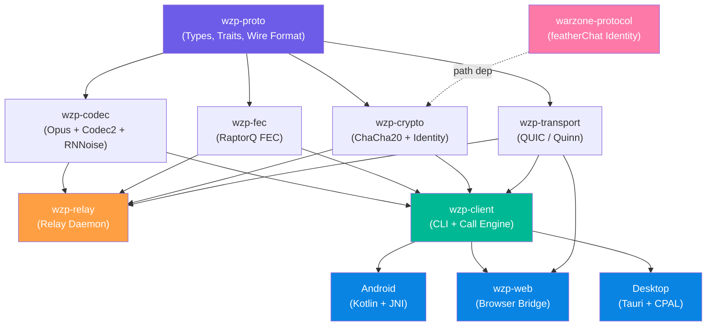
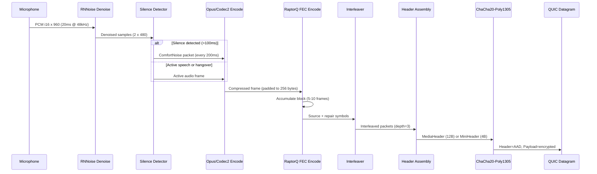
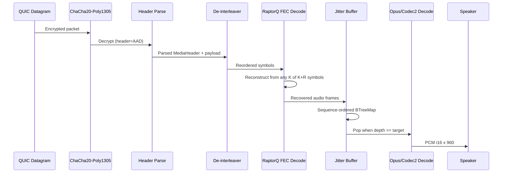
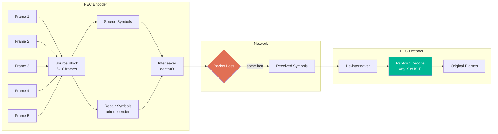
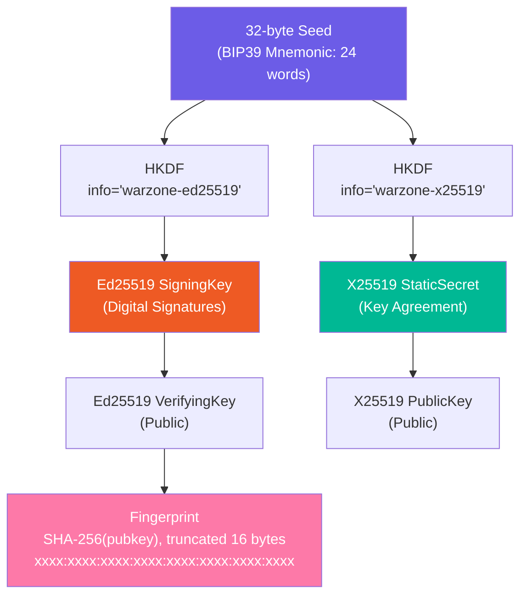
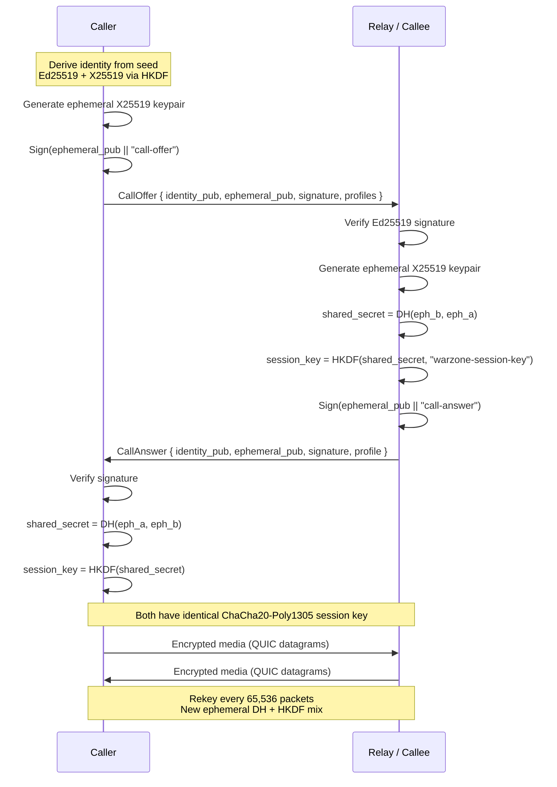
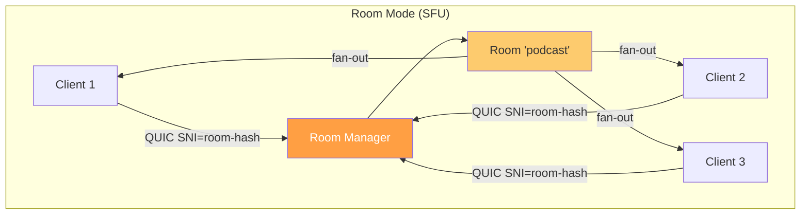
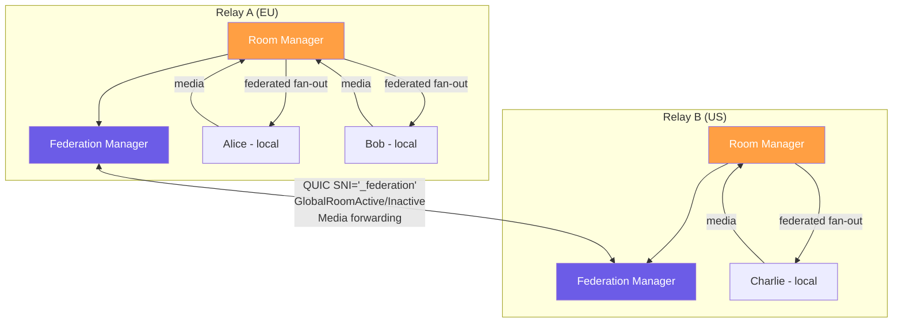

# WarzonePhone Design Document

> Custom encrypted VoIP protocol built in Rust. Designed for hostile network conditions: 5-70% packet loss, 100-500 kbps throughput, 300-800 ms RTT. Multi-platform: Desktop (Tauri), Android, CLI, Web.

## System Overview

WarzonePhone is a voice-over-IP system built from scratch in Rust, targeting reliable encrypted voice communication over severely degraded networks. The protocol uses adaptive codecs (Opus + Codec2), fountain-code FEC (RaptorQ), and end-to-end ChaCha20-Poly1305 encryption over a QUIC transport layer.

The system comprises three categories of components:

1. **Protocol crates** -- a Rust workspace of 7 library crates with a star dependency graph enabling parallel development
2. **Client applications** -- Desktop (Tauri), Android (Kotlin + JNI), CLI, and Web (browser bridge)
3. **Relay infrastructure** -- SFU relay daemons with federation, health probing, and Prometheus metrics

### Design Principles

- **User sovereignty** -- client-driven route selection, BIP39 identity backup, no central authority
- **End-to-end encryption** -- relays never see plaintext audio; SFU forwarding preserves E2E encryption
- **Adaptive resilience** -- automatic codec and FEC switching based on observed network quality
- **Parallel development** -- star dependency graph allows 5 agents/developers to work simultaneously with zero merge conflicts

## Architecture

### Crate Overview

The workspace contains 7 core crates plus integration binaries:

| Crate | Purpose | Key Dependencies |
|-------|---------|-----------------|
| `wzp-proto` | Protocol types, traits, wire format | serde, bytes |
| `wzp-codec` | Audio codecs (Opus, Codec2, RNNoise) | audiopus, codec2, nnnoiseless |
| `wzp-fec` | Forward error correction | raptorq |
| `wzp-crypto` | Cryptography and identity | ed25519-dalek, x25519-dalek, chacha20poly1305, bip39 |
| `wzp-transport` | QUIC transport layer | quinn, rustls |
| `wzp-relay` | Relay daemon (SFU, federation, metrics) | tokio, prometheus |
| `wzp-client` | Call engine and CLI | All above |

Additional integration targets: `wzp-web` (browser bridge via WebSocket), Android native library (JNI), Desktop (Tauri).

### Dependency Graph



The star pattern ensures each leaf crate (`wzp-codec`, `wzp-fec`, `wzp-crypto`, `wzp-transport`) depends only on `wzp-proto` and never on each other. This enables:

- **Parallel development** -- 5 agents work on 5 crates with no merge conflicts
- **Independent testing** -- each crate has self-contained tests
- **Pluggability** -- any implementation can be swapped by implementing the same trait
- **Fast compilation** -- changing one leaf only recompiles that leaf and integration crates

## Audio Pipeline

### Encode Pipeline (Mic to Network)



### Decode Pipeline (Network to Speaker)



## Codec System

WarzonePhone uses a dual-codec architecture to cover the full range of network conditions:

### Opus (Primary)

Opus is the primary codec for normal to degraded conditions. It operates at 48 kHz natively with built-in inband FEC and DTX (discontinuous transmission). The `audiopus` crate provides mature Rust bindings to libopus.

| Profile | Bitrate | Frame Duration | FEC Ratio | Total Bandwidth | Use Case |
|---------|---------|---------------|-----------|----------------|----------|
| Studio 64k | 64 kbps | 20ms | 10% | 70.4 kbps | LAN, excellent WiFi |
| Studio 48k | 48 kbps | 20ms | 10% | 52.8 kbps | Good WiFi, wired |
| Studio 32k | 32 kbps | 20ms | 10% | 35.2 kbps | WiFi, LTE |
| Good (24k) | 24 kbps | 20ms | 20% | 28.8 kbps | WiFi, LTE, decent links |
| Opus 16k | 16 kbps | 20ms | 20% | 19.2 kbps | 3G, moderate congestion |
| Degraded (6k) | 6 kbps | 40ms | 50% | 9.0 kbps | 3G, congested WiFi |

### Codec2 (Fallback)

Codec2 is a narrowband vocoder designed for HF radio links with extreme bandwidth constraints. It operates at 8 kHz, and the adaptive layer handles 48 kHz <-> 8 kHz resampling transparently. The pure-Rust `codec2` crate means no C dependencies.

| Profile | Bitrate | Frame Duration | FEC Ratio | Total Bandwidth | Use Case |
|---------|---------|---------------|-----------|----------------|----------|
| Codec2 3200 | 3.2 kbps | 20ms | 50% | 4.8 kbps | Poor conditions |
| Catastrophic (1200) | 1.2 kbps | 40ms | 100% | 2.4 kbps | Satellite, extreme loss |

### ComfortNoise

When the silence detector identifies no speech activity for over 100ms, the encoder switches to emitting a ComfortNoise packet every 200ms instead of encoding silence. This provides approximately 50% bandwidth savings in typical conversations.

### Adaptive Switching

The `AdaptiveEncoder`/`AdaptiveDecoder` in `wzp-codec` hold both codec instances and switch between them based on the active `QualityProfile`. This avoids codec re-initialization latency during tier transitions. The `AdaptiveQualityController` in `wzp-proto` manages tier transitions with hysteresis:

- **Downgrade**: 3 consecutive bad reports (2 on cellular networks)
- **Upgrade**: 10 consecutive good reports (one tier at a time)
- **Network handoff**: WiFi-to-cellular switch triggers preemptive one-tier downgrade plus a temporary 10-second FEC boost (+20%)

Quality tier classification thresholds:

| Tier | WiFi/Unknown | Cellular |
|------|-------------|----------|
| Good | loss < 10%, RTT < 400ms | loss < 8%, RTT < 300ms |
| Degraded | loss 10-40%, RTT 400-600ms | loss 8-25%, RTT 300-500ms |
| Catastrophic | loss > 40%, RTT > 600ms | loss > 25%, RTT > 500ms |

## Forward Error Correction (FEC)

### Why RaptorQ Over Reed-Solomon

WarzonePhone uses RaptorQ (RFC 6330) fountain codes via the `raptorq` crate:

1. **Rateless** -- generate arbitrary repair symbols on the fly; if conditions worsen mid-block, generate additional repair without re-encoding
2. **Efficient decoding** -- decode from any K symbols with high probability (typically K + 1 or K + 2 suffice)
3. **Lower complexity** -- O(K) encoding/decoding time vs O(K^2) for Reed-Solomon
4. **Variable block sizes** -- 1-56,403 source symbols per block (WZP uses 5-10)

### FEC Block Structure

Each FEC block consists of 5-10 audio frames padded to 256-byte symbols with a 2-byte LE length prefix:

```
[len:u16 LE][audio_frame][zero_padding_to_256_bytes]
```

### Loss Survival by FEC Ratio

With 5 source frames per block:

| FEC Ratio | Repair Symbols | Survives Loss | Profile |
|-----------|---------------|---------------|---------|
| 10% | 1 | 1 of 6 (16.7%) | Studio |
| 20% | 1 | 1 of 6 (16.7%) | Good |
| 50% | 3 | 3 of 8 (37.5%) | Degraded |
| 100% | 5 | 5 of 10 (50.0%) | Catastrophic |

### Interleaving

Burst loss protection via depth-3 interleaving: packets from 3 consecutive FEC blocks are interleaved before transmission. A burst of 3 consecutive lost packets affects 3 different blocks (1 loss each) rather than destroying 1 block entirely.



## Transport Layer

### Why QUIC Over Raw UDP

WarzonePhone uses QUIC (via the `quinn` crate) rather than raw UDP for several reasons:

| Feature | Benefit |
|---------|---------|
| DATAGRAM frames (RFC 9221) | Unreliable delivery without head-of-line blocking -- behaves like UDP for media |
| Reliable streams | Multiplexed signaling (CallOffer, Hangup, Rekey) without a separate TCP connection |
| Congestion control | Prevents overwhelming degraded links, important when chaining relays |
| Connection migration | Connections survive IP address changes (WiFi to cellular handoff) |
| TLS 1.3 built-in | Transport-level encryption protects headers and signaling |
| NAT keepalive | 5-second interval maintains NAT bindings without application-level pings |
| Firewall traversal | Runs on UDP port 443 with `wzp` ALPN identifier |

The tradeoff is approximately 20-40 bytes of additional per-packet overhead compared to raw UDP.

### Wire Formats

#### MediaHeader (12 bytes)

```
Byte 0:  [V:1][T:1][CodecID:4][Q:1][FecRatioHi:1]
Byte 1:  [FecRatioLo:6][unused:2]
Bytes 2-3: sequence (u16 BE)
Bytes 4-7: timestamp_ms (u32 BE)
Byte 8:   fec_block_id (u8)
Byte 9:   fec_symbol_idx (u8)
Byte 10:  reserved
Byte 11:  csrc_count

V = version (0), T = is_repair, CodecID = codec, Q = quality_report appended
```

#### MiniHeader (4 bytes, compressed)

```
Bytes 0-1: timestamp_delta_ms (u16 BE)
Bytes 2-3: payload_len (u16 BE)

Preceded by FRAME_TYPE_MINI (0x01). Full header every 50 frames (~1s).
Saves 8 bytes/packet (67% header reduction).
```

#### TrunkFrame (batched datagrams)

```
[count:u16]
  [session_id:2][len:u16][payload:len]  x count

Packs multiple session packets into one QUIC datagram.
Max 10 entries or 1200 bytes, flushed every 5ms.
```

#### QualityReport (4 bytes, optional trailer)

```
Byte 0: loss_pct (0-255 maps to 0-100%)
Byte 1: rtt_4ms (0-255 maps to 0-1020ms)
Byte 2: jitter_ms
Byte 3: bitrate_cap_kbps
```

### Bandwidth Summary

| Profile | Audio | FEC Overhead | Total | Silence Savings |
|---------|-------|-------------|-------|----------------|
| Studio 64k | 64 kbps | 10% = 6.4 kbps | **70.4 kbps** | ~50% with DTX |
| Studio 48k | 48 kbps | 10% = 4.8 kbps | **52.8 kbps** | ~50% with DTX |
| Studio 32k | 32 kbps | 10% = 3.2 kbps | **35.2 kbps** | ~50% with DTX |
| Good (24k) | 24 kbps | 20% = 4.8 kbps | **28.8 kbps** | ~50% with DTX |
| Degraded (6k) | 6 kbps | 50% = 3.0 kbps | **9.0 kbps** | ~50% with DTX |
| Catastrophic (1.2k) | 1.2 kbps | 100% = 1.2 kbps | **2.4 kbps** | ~50% with DTX |

Additional savings: MiniHeaders save 8 bytes/packet (67% header reduction). Trunking shares QUIC overhead across multiplexed sessions.

## Security

### Identity Model

Every user has a persistent identity derived from a 32-byte seed:



**BIP39 Mnemonic Backup**: The 32-byte seed can be encoded as a 24-word BIP39 mnemonic for human-readable backup. The same seed produces the same identity on any platform.

**featherChat Compatibility**: The identity derivation is compatible with the Warzone messenger (featherChat), allowing a shared identity across messaging and calling.

### Cryptographic Handshake



### Encryption Details

| Component | Algorithm | Purpose |
|-----------|-----------|---------|
| Identity signing | Ed25519 | Authenticate handshake messages |
| Key agreement | X25519 (ephemeral) | Derive shared secret |
| Key derivation | HKDF-SHA256 | Derive session key from shared secret |
| Media encryption | ChaCha20-Poly1305 | Encrypt audio payloads (16-byte tag) |
| Nonce construction | Deterministic from sequence number | No nonce reuse, no state sync needed |
| Anti-replay | Sliding window (64-packet) | Reject duplicate/old packets |
| Forward secrecy | Rekey every 65,536 packets | New ephemeral DH + HKDF mix |

**Why ChaCha20-Poly1305 over AES-GCM**:
- Faster on hardware without AES-NI (ARM phones, Raspberry Pi relays)
- Inherently constant-time (add-rotate-XOR only)
- Compatible with Warzone messenger (featherChat)
- Same 16-byte authentication tag overhead as AES-GCM

**AEAD with AAD**: The MediaHeader is used as Associated Authenticated Data. The header is authenticated but not encrypted, allowing relays to read routing information (block ID, sequence number) without decrypting the payload.

### Trust on First Use (TOFU)

Clients remember the relay's TLS certificate fingerprint after first connection. If the fingerprint changes on a subsequent connection, the desktop client shows a "Server Key Changed" warning dialog. The relay derives its TLS certificate deterministically from its persisted identity seed, so the fingerprint is stable across restarts.

## Relay Architecture

### Room Mode (Default SFU)

In room mode, the relay acts as a Selective Forwarding Unit. Clients join named rooms via the QUIC SNI (Server Name Indication) field. The relay forwards each participant's encrypted packets to all other participants in the room without decoding or re-encoding.



**SFU vs MCU trade-off**: SFU was chosen because it preserves end-to-end encryption (the relay never sees plaintext audio). An MCU would need to decode, mix, and re-encode, breaking E2E encryption. The trade-off is O(N) bandwidth at the relay for N participants.

### Forward Mode

With `--remote`, the relay forwards all traffic to a remote relay. Used for chaining relays across lossy or censored links:

```
Client --> Relay A (--remote B) --> Relay B --> Destination Client
```

The relay pipeline in forward mode: FEC decode, jitter buffer, then FEC re-encode for the next hop.

## Federation

### Overview

Two or more relays form a federation mesh. Each relay is an independent SFU. When configured to trust each other, they bridge **global rooms** -- participants on relay A in a global room hear participants on relay B in the same room.

### Configuration

Federation uses three TOML configuration sections:

- `[[peers]]` -- outbound connections to peer relays (url + TLS fingerprint)
- `[[trusted]]` -- inbound connections accepted from relays (TLS fingerprint only)
- `[[global_rooms]]` -- room names to bridge across all federated peers

### Federation Topology



### Protocol

1. On startup, each relay connects to all configured `[[peers]]` via QUIC with SNI `"_federation"`
2. After QUIC handshake, sends `FederationHello { tls_fingerprint }` for identity verification
3. Peer verifies the fingerprint against its `[[trusted]]` or `[[peers]]` list
4. When a local participant joins a global room, sends `GlobalRoomActive { room }` to all peers
5. When the last local participant leaves, sends `GlobalRoomInactive { room }`
6. Media is forwarded as `[room_hash:8][original_media_packet]` -- the relay does not decrypt

### What Relays Do NOT Do

- **No transcoding** -- media passes through as-is
- **No re-encryption** -- packets are already encrypted E2E
- **No central coordinator** -- each relay independently connects to configured peers
- **No automatic peer discovery** -- peers must be explicitly configured

### Failure Handling

- If a peer goes down, local rooms continue working; federated participants disappear from presence
- Reconnection: every 30 seconds with exponential backoff up to 5 minutes
- If a peer restarts with a different identity, the fingerprint check fails with a clear log message

## Jitter Buffer

The jitter buffer balances latency vs quality:

| Setting | Client | Relay |
|---------|--------|-------|
| Target depth | 10 packets (200ms) | 50 packets (1s) |
| Minimum before playout | 3 packets (60ms) | 25 packets (500ms) |
| Maximum cap | 250 packets (5s) | 250 packets (5s) |

The relay uses a deeper buffer to absorb jitter from lossy inter-relay links. The client uses a shallower buffer for lower latency.

The adaptive playout delay tracks jitter via exponential moving average and adjusts the target depth:

```
target_delay = ceil(jitter_ema / 20ms) + 2
```

**Known limitation**: The current jitter buffer does not use timestamp-based playout scheduling. It relies on sequence-number ordering only, which can lead to drift during long calls.

## Signal Messages

Signal messages are sent over reliable QUIC streams as length-prefixed JSON:

```
[4-byte length prefix][serde_json payload]
```

| Message | Purpose |
|---------|---------|
| `CallOffer` | Identity, ephemeral key, signature, supported profiles |
| `CallAnswer` | Identity, ephemeral key, signature, chosen profile |
| `AuthToken` | featherChat bearer token for relay authentication |
| `Hangup` | Reason: Normal, Busy, Declined, Timeout, Error |
| `Hold` / `Unhold` | Call hold state |
| `Mute` / `Unmute` | Mic mute state |
| `Transfer` | Call transfer to another relay/fingerprint |
| `Rekey` | New ephemeral key for forward secrecy |
| `QualityUpdate` | Quality report + recommended profile |
| `Ping` / `Pong` | Latency measurement (timestamp_ms) |
| `RoomUpdate` | Participant list changes |
| `PresenceUpdate` | Federation presence gossip |
| `RouteQuery` / `RouteResponse` | Presence discovery for routing |
| `FederationHello` | Relay identity during federation setup |
| `GlobalRoomActive` / `GlobalRoomInactive` | Federation room bridging |

## Test Coverage

272 tests across all crates, 0 failures:

| Crate | Tests | Key Coverage |
|-------|-------|-------------|
| wzp-proto | 41 | Wire format, jitter buffer, quality tiers, mini-frames, trunking |
| wzp-codec | 31 | Opus/Codec2 roundtrip, silence detection, noise suppression |
| wzp-fec | 22 | RaptorQ encode/decode, loss recovery, interleaving |
| wzp-crypto | 34 + 28 compat | Encrypt/decrypt, handshake, anti-replay, featherChat identity |
| wzp-transport | 2 | QUIC connection setup |
| wzp-relay | 40 + 4 integration | Room ACL, session mgmt, metrics, probes, mesh, trunking |
| wzp-client | 30 + 2 integration | Encoder/decoder, quality adapter, silence, drift, sweep |
| wzp-web | 2 | Metrics |

## Audio Routing (Android)

WarzonePhone supports three audio output routes on Android: **Earpiece**, **Speaker**, and **Bluetooth SCO**. The user cycles through available routes with a single button.

### Audio mode lifecycle

`MODE_IN_COMMUNICATION` is set **when the call engine starts** (right before Oboe `audio_start()`), not at app launch. This is critical — setting it early hijacks system audio routing (e.g. music drops from BT A2DP to earpiece). `MODE_NORMAL` is restored when the call engine stops.

```
App launch  → MODE_NORMAL (other apps' audio unaffected)
Call start  → set_audio_mode_communication() → MODE_IN_COMMUNICATION
Call end    → audio_stop() → set_audio_mode_normal() → MODE_NORMAL
```

### Route lifecycle

1. Call starts → Earpiece (default).
2. User taps route button → cycles to next available route.
3. Route change requires Oboe stream restart (~60-400ms) because AAudio silently tears down streams on some OEMs when the routing target changes mid-stream.
4. Bluetooth disconnect mid-call → `AudioDeviceCallback.onAudioDevicesRemoved` fires → auto-fallback to Earpiece or Speaker.

### Bluetooth SCO

SCO (Synchronous Connection Oriented) is the correct Bluetooth profile for VoIP — it provides bidirectional mono audio at 8/16 kHz with ~30ms latency. A2DP (stereo, high-quality) is unidirectional and adds 100-200ms of buffering, making it unsuitable for real-time voice.

On API 31+ (Android 12), we use the modern `setCommunicationDevice(AudioDeviceInfo)` API to route audio to the BT SCO device. The deprecated `startBluetoothSco()` + `setBluetoothScoOn()` path is used as fallback on older APIs. `setBluetoothScoOn()` is silently rejected on Android 12+ for non-system apps.

BT SCO devices only support 8/16kHz sample rates, but our pipeline runs at 48kHz. When BT is active, Oboe opens in **BT mode** (`bt_active=1`): capture skips `setSampleRate(48000)` and `setInputPreset(VoiceCommunication)`, letting the system open at the device's native rate. Oboe's `SampleRateConversionQuality::Best` resamples to/from 48kHz for our ring buffers.

### Two app variants

Both the native Kotlin app (`AudioRouteManager.kt`) and the Tauri app (`android_audio.rs` JNI bridge) support BT SCO routing. The native app uses `AudioDeviceCallback` for automatic device detection; the Tauri app uses `getAvailableCommunicationDevices()` (API 31+) or `getDevices()` on demand.

## Network Change Response

The `AdaptiveQualityController` in `wzp-proto` reacts to network transport changes signaled via `signal_network_change(NetworkContext)`:

| Transition | Response |
|-----------|----------|
| WiFi → Cellular | Preemptive 1-tier quality downgrade + 10s FEC boost |
| Cellular → WiFi | FEC boost only (quality recovers via normal adaptive logic) |
| Any change | Reset hysteresis counters to avoid stale state |

On Android, `NetworkMonitor.kt` wraps `ConnectivityManager.NetworkCallback` and classifies the transport type using bandwidth heuristics (no `READ_PHONE_STATE` needed). The classification is delivered to the Rust engine via JNI → `AtomicU8` → recv task polling — the same lock-free cross-task signaling pattern used for adaptive profile switches.

### Cellular generation heuristics

| Downstream bandwidth | Classification |
|---------------------|---------------|
| >= 100 Mbps | 5G NR |
| >= 10 Mbps | LTE |
| < 10 Mbps | 3G or worse |

These thresholds are conservative. Carriers over-report bandwidth, but for VoIP quality decisions the exact generation matters less than the rough category.

## Build Requirements

- **Rust** 1.85+ (2024 edition)
- **Linux**: cmake, pkg-config, libasound2-dev (for audio feature)
- **macOS**: Xcode command line tools (CoreAudio included)
- **Android**: NDK 26.1 (r26b), cmake 3.25-3.28 (system package)

### Android APK Builds

```bash
# arm64 only (default, 25MB release APK)
./scripts/build-tauri-android.sh --init --release --arch arm64

# armv7 only (smaller devices)
./scripts/build-tauri-android.sh --init --release --arch armv7

# both architectures as separate APKs
./scripts/build-tauri-android.sh --init --release --arch all
```

Release APKs are signed with `android/keystore/wzp-release.jks` via `apksigner`. Per-arch builds produce separate APKs (~25MB each vs ~50MB universal) for easier sharing with testers.
