# WZP Web Client Variants

Three browser-based client implementations with different trade-offs between simplicity, features, and performance.

## Variant Comparison

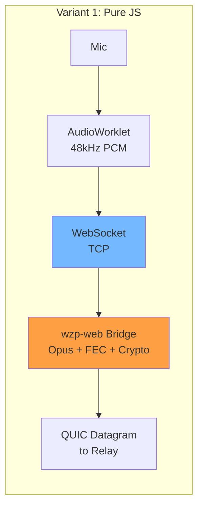

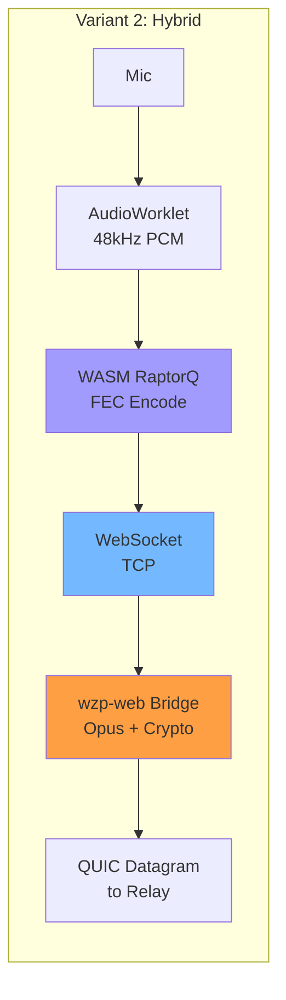

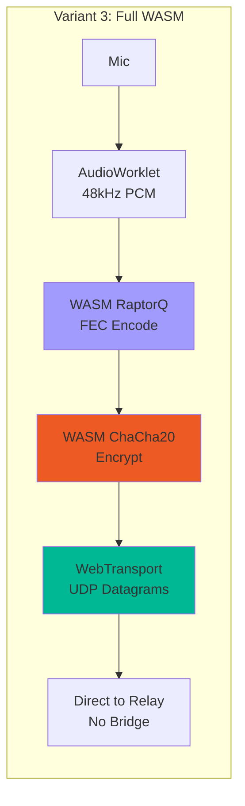

## Summary Table

| | Pure JS | Hybrid | Full WASM |
|--|---------|--------|-----------|
| **Bundle** | ~20KB JS | ~120KB (JS + 337KB WASM) | ~20KB JS + 337KB WASM |
| **Transport** | WebSocket (TCP) | WebSocket (TCP) | WebTransport (UDP) |
| **Encryption** | Bridge-side (ChaCha20 on QUIC) | Bridge-side | Browser-side ChaCha20-Poly1305 WASM |
| **FEC** | None | RaptorQ WASM (ready, not active over TCP) | RaptorQ WASM (active over UDP) |
| **Codec** | Bridge Opus (server-side) | Bridge Opus | Browser Opus (future) / Bridge Opus |
| **E2E Encrypted** | No (bridge sees plaintext PCM) | No (bridge sees plaintext PCM) | Yes (bridge eliminated) |
| **Latency** | ~50-80ms (TCP overhead) | ~50-80ms (TCP) | ~20-40ms (UDP datagrams) |
| **Loss Recovery** | TCP retransmit (adds latency) | TCP retransmit | RaptorQ FEC (no retransmit) |
| **Browser Support** | All browsers | All browsers | Chrome 97+, Edge 97+, Firefox 114+, Safari 17.4+ |
| **Relay Changes** | None | None | Needs HTTP/3 (h3-quinn) |
| **Status** | Ready | Ready (FEC testable in console) | Architecture complete, needs relay HTTP/3 |

## Variant 1: Pure JS

The lightest implementation. No WASM, no FEC, no browser-side encryption. The `wzp-web` Rust bridge handles everything on the server side.

### Architecture

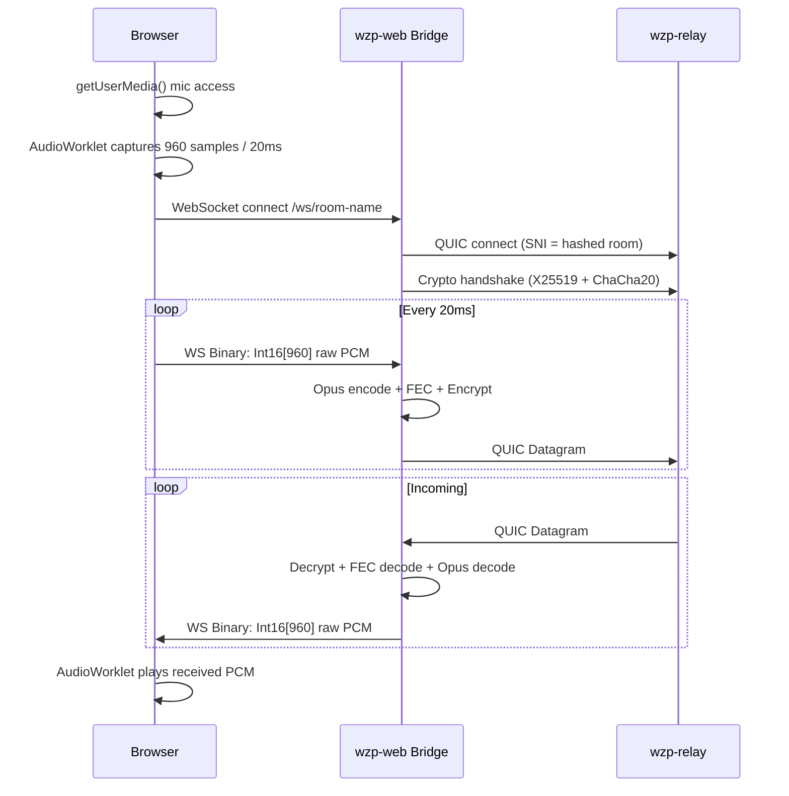

### Data Flow

```
Browser (Pure JS)
├── Capture: getUserMedia → AudioWorklet (WZPCaptureProcessor)
│   └── 128-sample blocks accumulated → 960-sample frame
│       └── Float32 → Int16 conversion
│           └── postMessage(ArrayBuffer) to main thread
├── Send: onmessage → ws.send(pcmBuffer)
│   └── Binary WebSocket frame (1920 bytes = 960 × 2)
├── Receive: ws.onmessage → ArrayBuffer
│   └── Int16Array(960) → playback port
└── Playback: AudioWorklet (WZPPlaybackProcessor)
    └── Ring buffer (max 120ms)
        └── Int16 → Float32 → output blocks
```

### Files
- `js/wzp-pure.js` — `WZPPureClient` class (~100 lines)
- `js/wzp-core.js` — Shared UI + audio (used by all variants)
- `audio-processor.js` — AudioWorklet (unchanged)

### Limitations
- No packet loss recovery (TCP retransmit adds latency spikes)
- Bridge sees plaintext audio (not E2E encrypted)
- Full audio processing pipeline runs on server (Opus, FEC, crypto)
- Each browser connection = one QUIC session on the bridge

---

## Variant 2: Hybrid (JS + WASM FEC)

Adds RaptorQ forward error correction via a small WASM module. Same WebSocket transport as Pure — the FEC module is loaded and functional but doesn't add value over TCP (no packet loss). It's ready to activate when WebTransport replaces WebSocket.

### Architecture

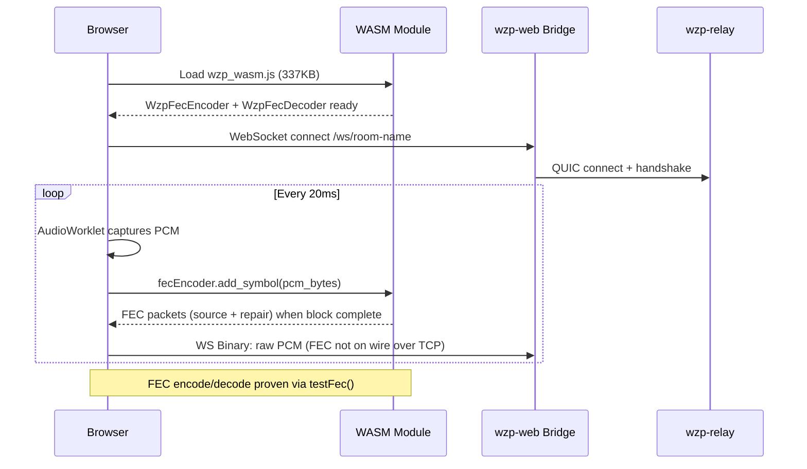

### WASM Module (wzp-wasm)

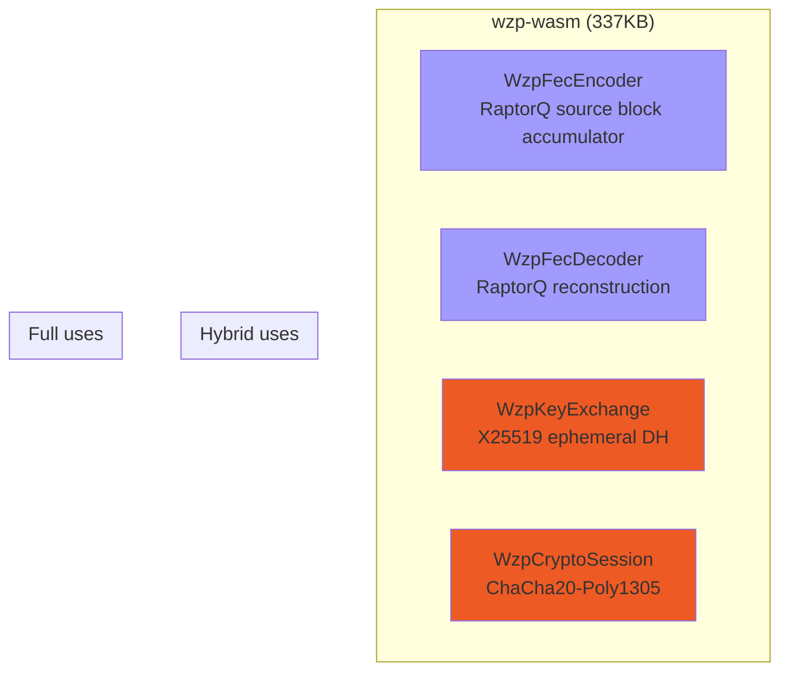

### FEC Wire Format

```
Per symbol (encoded by WASM, 259 bytes):
┌──────────┬───────────┬──────────┬──────────────────┐
│ block_id │ symbol_idx│ is_repair│ symbol_data      │
│ (1 byte) │ (1 byte)  │ (1 byte) │ (256 bytes)      │
└──────────┴───────────┴──────────┴──────────────────┘

Symbol data internals (256 bytes):
┌────────────┬──────────────────┬─────────┐
│ length     │ audio frame data │ padding │
│ (2B LE)    │ (variable)       │ (zeros) │
└────────────┴──────────────────┴─────────┘

Block = 5 source symbols + ceil(5 × 0.5) = 3 repair symbols = 8 total
Any 5 of 8 received → full block recoverable (RaptorQ fountain code)
```

### Testing FEC in Browser Console

```javascript
// On any hybrid variant page, open console:
client.testFec({ lossRate: 0.3, blockSize: 5, symbolSize: 256 })
// Output: "FEC test passed — recovered from 30% loss"

client.testFec({ lossRate: 0.5 })
// Output: "FEC test passed — recovered from 50% loss"
```

### Files
- `js/wzp-hybrid.js` — `WZPHybridClient` class (~150 lines)
- `js/wzp-core.js` — Shared UI + audio
- `wasm/wzp_wasm.js` + `wasm/wzp_wasm_bg.wasm` — WASM module (337KB)

### Limitations
- FEC doesn't help over TCP WebSocket (no packet loss to recover from)
- Bridge still sees plaintext audio
- WebTransport activation is the unlock for FEC value

---

## Variant 3: Full WASM + WebTransport

The complete WZP client in the browser. No bridge server needed — the browser connects directly to the relay via WebTransport unreliable datagrams. All encryption and FEC happens in WASM.

### Architecture

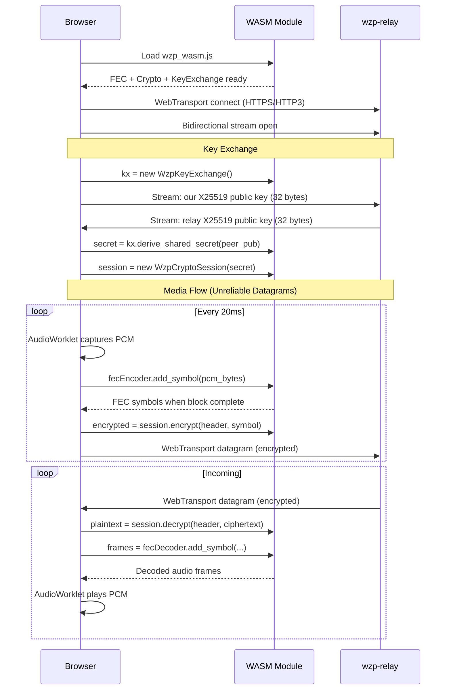

### Encryption Flow

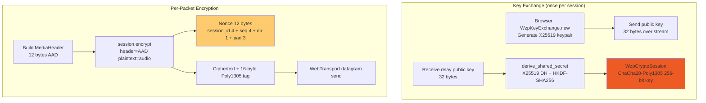

### Nonce Construction (matches native wzp-crypto)

```
Bytes 0-3:   session_id (SHA-256(session_key)[:4])
Bytes 4-7:   sequence_number (u32 BE, incrementing)
Byte 8:      direction (0x00 = send, 0x01 = recv)
Bytes 9-11:  0x000000 (padding)

Total: 12 bytes — deterministic, never reused (seq increments)
```

### Send Pipeline Detail

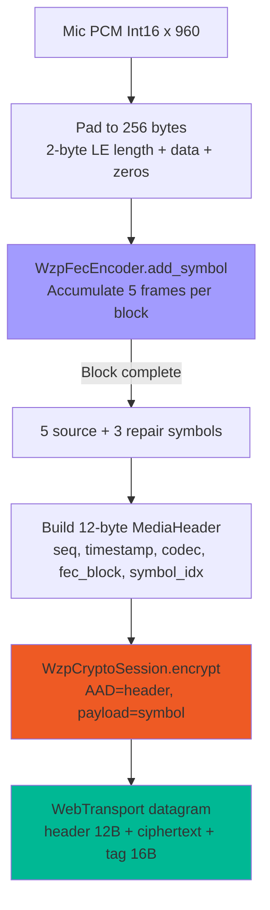

### Receive Pipeline Detail

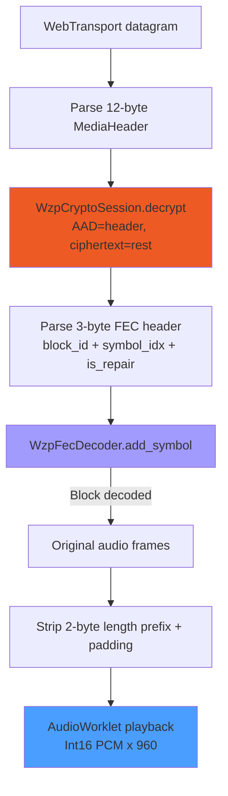

### Testing Crypto + FEC in Browser Console

```javascript
// On any full variant page, open console:
client.testCryptoFec()
// Tests: key exchange → encrypt → FEC encode → simulate 30% loss → FEC decode → decrypt
// Output: "Crypto+FEC test passed — key exchange, encrypt, FEC(30% loss), decrypt all OK"
```

### Files
- `js/wzp-full.js` — `WZPFullClient` class (~250 lines)
- `js/wzp-core.js` — Shared UI + audio
- `wasm/wzp_wasm.js` + `wasm/wzp_wasm_bg.wasm` — WASM module (337KB, shared with hybrid)

### Requirements (not yet met)
- Relay must support HTTP/3 WebTransport (h3-quinn integration)
- Real TLS certificate (WebTransport requires valid HTTPS)
- Browser with WebTransport support (Chrome 97+, Edge 97+, Firefox 114+, Safari 17.4+)

### Limitations
- No Opus encoding in browser yet (sends raw PCM, relay/peer decodes)
- Key exchange is simplified (no Ed25519 signature verification in WASM yet)
- No adaptive quality switching in browser (server-side only)

---

## Shared Infrastructure

### wzp-core.js

Common code used by all three variants:

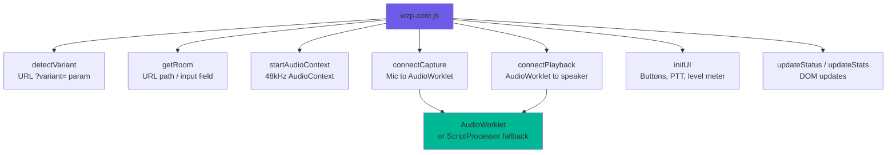

### AudioWorklet Processors (audio-processor.js)

```
WZPCaptureProcessor:
  AudioWorklet process() → 128 samples per call
  Buffer internally until 960 samples (20ms frame)
  Convert Float32 → Int16
  postMessage(ArrayBuffer) to main thread

WZPPlaybackProcessor:
  Receive Int16 PCM via port.onmessage
  Convert Int16 → Float32
  Write to ring buffer (max ~120ms / 6 frames)
  process() reads from ring buffer → output
```

### index.html Boot Sequence

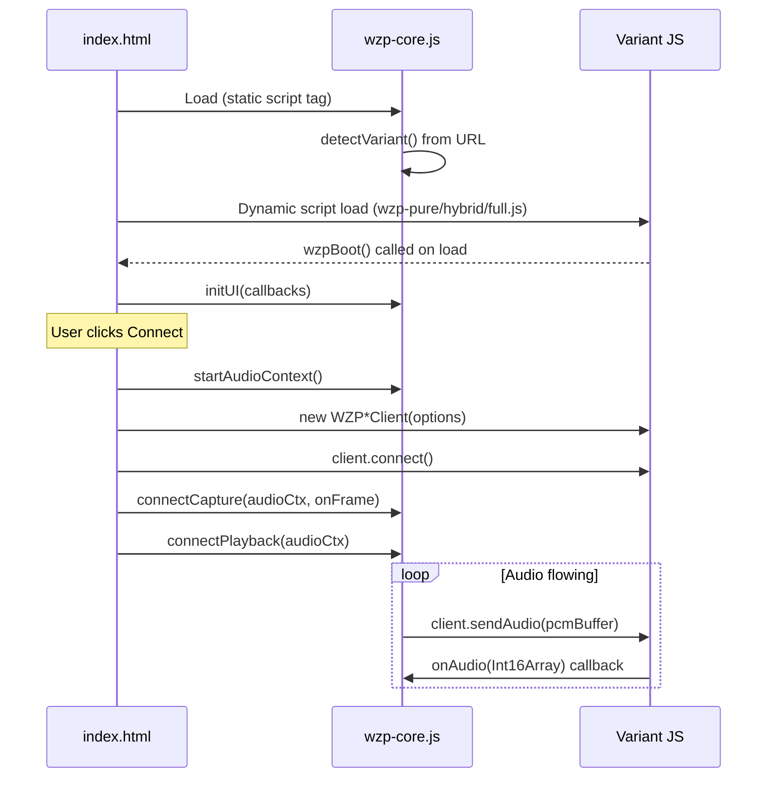

## Deployment

### Behind Caddy (recommended)

```
# Caddyfile
wzp.example.com {
    reverse_proxy 127.0.0.1:8080
}
```

```bash
# Relay
./wzp-relay --listen 0.0.0.0:4433

# Web bridge (no --tls, Caddy handles SSL)
./wzp-web --port 8080 --relay 127.0.0.1:4433
```

### Direct TLS

```bash
./wzp-web --port 443 --relay 127.0.0.1:4433 --tls \
  --cert /etc/letsencrypt/live/domain/fullchain.pem \
  --key /etc/letsencrypt/live/domain/privkey.pem
```

### URL Patterns

```
https://domain/room-name                    → Pure (default)
https://domain/room-name?variant=pure       → Pure JS
https://domain/room-name?variant=hybrid     → Hybrid (JS + WASM FEC)
https://domain/room-name?variant=full       → Full WASM (needs HTTP/3 relay)
```

## Future Work

1. **Relay HTTP/3 support** (h3-quinn) — unlocks Full variant for production
2. **Browser Opus encoding** — AudioEncoder API or Opus WASM, removes bridge dependency for Hybrid
3. **Ed25519 signatures in WASM** — full identity verification in Full variant
4. **Adaptive quality in browser** — monitor RTT/loss, switch profiles
5. **WebTransport fallback to WebSocket** — Full variant auto-degrades if WebTransport unavailable
