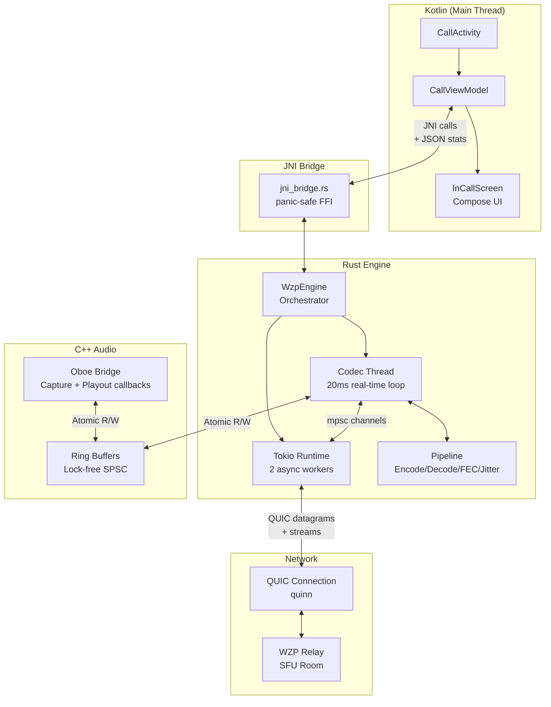
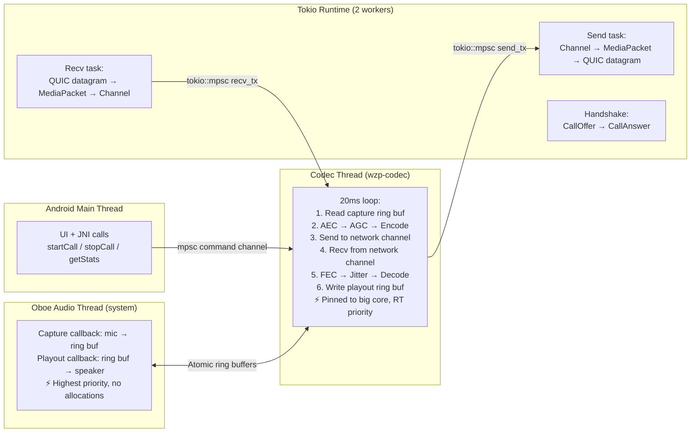
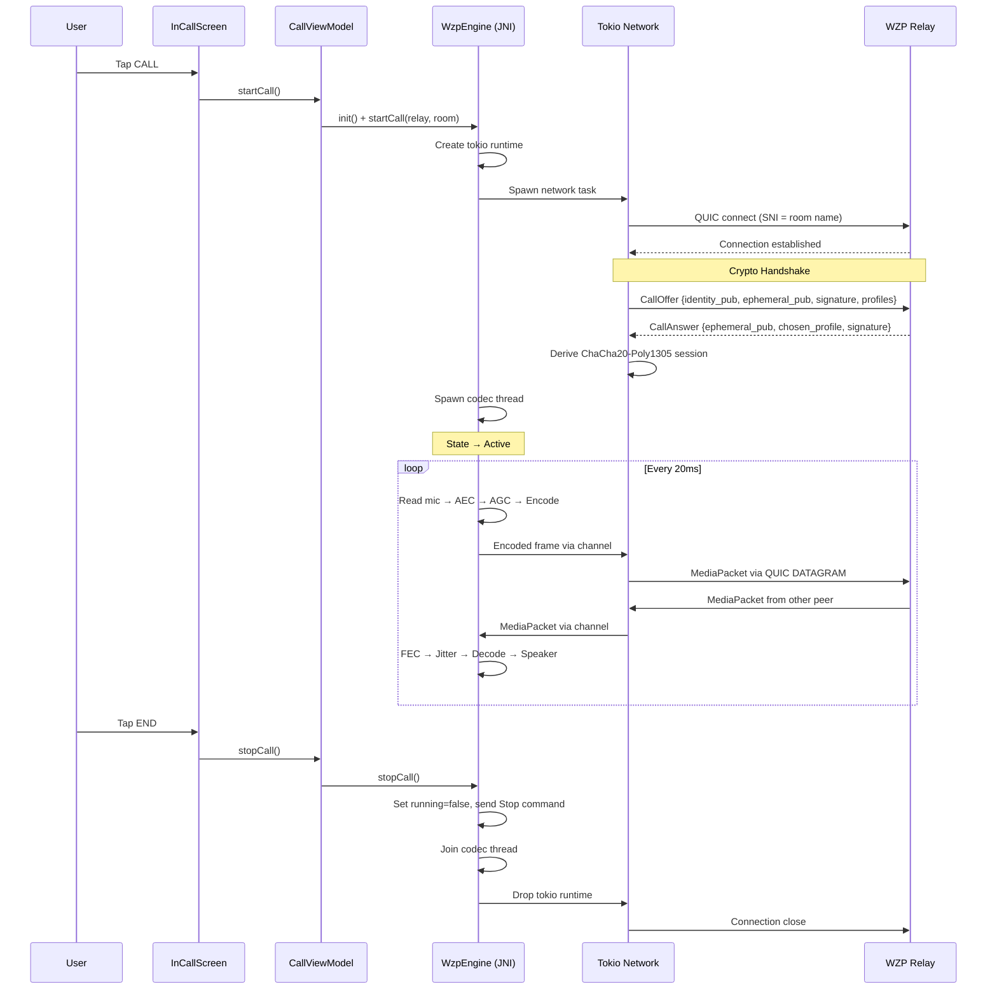
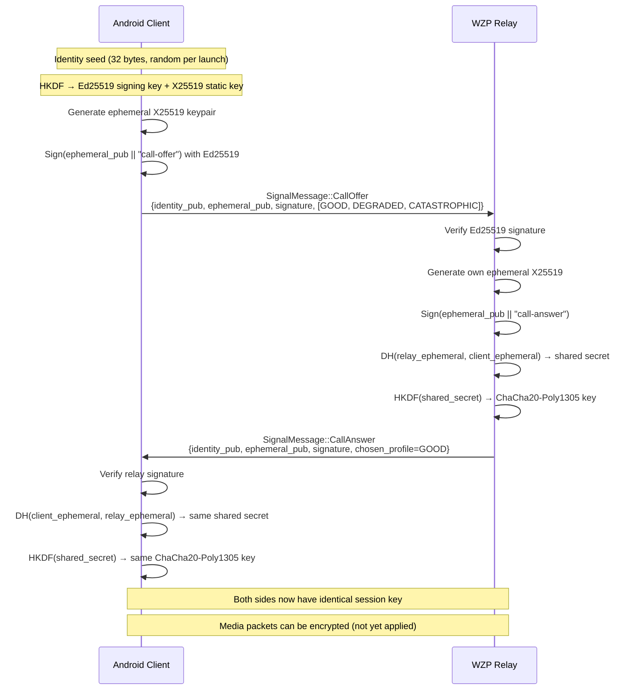
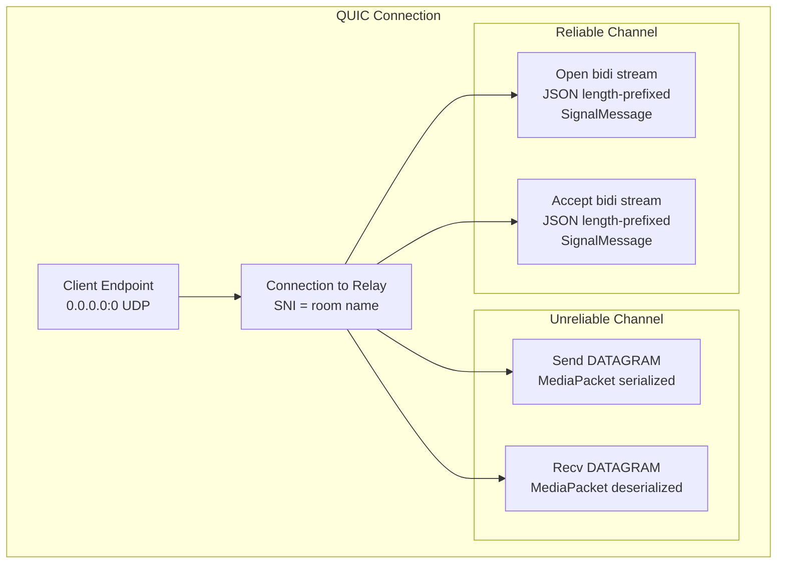
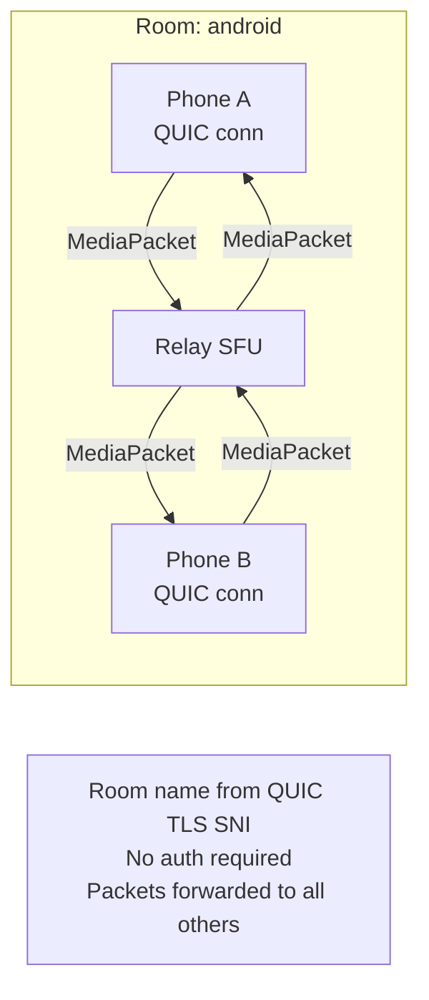
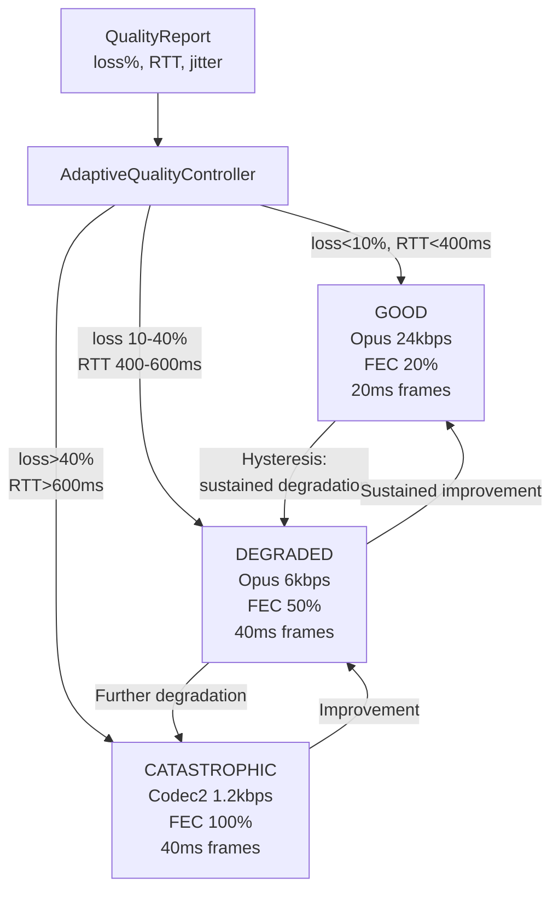
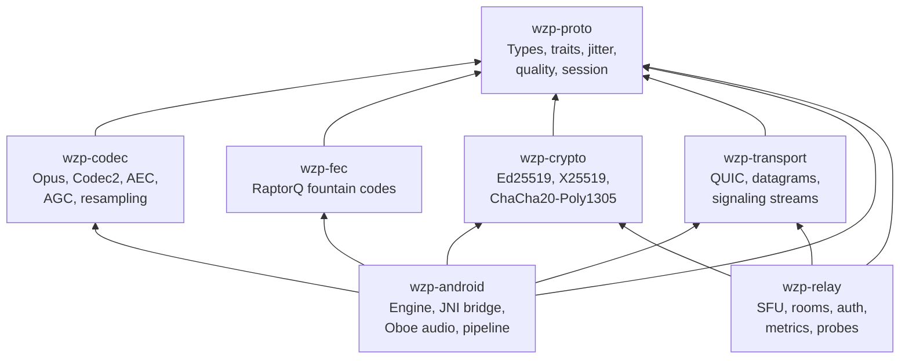

# Architecture

## System Overview

The Android client is a four-layer stack: Kotlin UI, JNI bridge, Rust engine, and C++ audio I/O. Each layer communicates through well-defined interfaces with minimal coupling.



## Thread Model

The engine uses four distinct thread contexts, each with specific responsibilities and real-time constraints.



### Thread Priorities and Constraints

| Thread | Priority | Allocations | Blocking | Lock-free |
|--------|----------|-------------|----------|-----------|
| Oboe audio | SCHED_FIFO (system) | None | Never | Yes |
| Codec | RT priority, big core | Pre-allocated buffers | sleep(remainder of 20ms) | Ring buf: yes, Stats: Mutex |
| Tokio workers | Normal | Allowed | Async only | N/A |
| Main/JNI | Normal | Allowed | Allowed | N/A |

## Call Lifecycle



## Audio Pipeline Detail

```mermaid
graph LR
    subgraph "Capture Path"
        MIC[Microphone] -->|"48kHz i16"| OBOE_C[Oboe Capture<br/>Callback]
        OBOE_C -->|"ring_write()"| RB_C[Capture<br/>Ring Buffer]
        RB_C -->|"read_capture()"| AEC[Echo<br/>Canceller]
        AEC --> AGC[Auto Gain<br/>Control]
        AGC --> ENC[AdaptiveEncoder<br/>Opus 24k]
        ENC -->|"Vec u8"| FEC_E[RaptorQ<br/>FEC Encoder]
        FEC_E -->|"send_tx"| CHAN_S[Send Channel]
    end

    subgraph "Network"
        CHAN_S --> PKT_S[MediaPacket<br/>Header + Payload]
        PKT_S -->|"QUIC DATAGRAM"| RELAY[Relay SFU]
        RELAY -->|"QUIC DATAGRAM"| PKT_R[MediaPacket<br/>Deserialize]
        PKT_R -->|"recv_tx"| CHAN_R[Recv Channel]
    end

    subgraph "Playout Path"
        CHAN_R --> FEC_D[RaptorQ<br/>FEC Decoder]
        FEC_D --> JB[Jitter Buffer<br/>10-250 pkts]
        JB --> DEC[AdaptiveDecoder<br/>Opus 24k]
        DEC -->|"48kHz i16"| AEC_REF[AEC Far-End<br/>Reference]
        DEC -->|"write_playout()"| RB_P[Playout<br/>Ring Buffer]
        RB_P -->|"ring_read()"| OBOE_P[Oboe Playout<br/>Callback]
        OBOE_P --> SPK[Speaker]
    end
```



### Audio Parameters

| Parameter | Value | Notes |
|-----------|-------|-------|
| Sample rate | 48,000 Hz | Opus native rate |
| Channels | 1 (mono) | VoIP only |
| Frame size | 960 samples | 20ms at 48kHz |
| Ring buffer | 7,680 samples | 160ms (8 frames) |
| Bit depth | 16-bit signed int | PCM format |
| AEC tail | 100ms | Echo canceller filter length |

## Crypto Handshake



### Key Derivation Chain

```
Identity Seed (32 bytes, random)
    │
    ├── HKDF(seed, info="warzone-ed25519") → Ed25519 signing key
    │       └── Public key = identity_pub (32 bytes)
    │       └── SHA-256(identity_pub)[:16] = fingerprint (16 bytes)
    │
    └── HKDF(seed, info="warzone-x25519") → X25519 static key (unused currently)

Per-Call Ephemeral:
    Random X25519 keypair → ephemeral_pub (sent in CallOffer)

Session Key:
    DH(our_ephemeral_secret, peer_ephemeral_pub) → shared_secret
    HKDF(shared_secret, info="warzone-session-key") → ChaCha20-Poly1305 key (32 bytes)
```

## QUIC Transport



### QUIC Configuration (VoIP-tuned)

| Setting | Value | Rationale |
|---------|-------|-----------|
| ALPN | `wzp` | Protocol identification |
| Idle timeout | 30s | Keep connection alive during silence |
| Keep-alive | 5s | Prevent NAT timeout |
| Datagram receive buffer | 65 KB | Buffer for burst arrivals |
| Flow control (recv) | 256 KB | Conservative for VoIP |
| Flow control (send) | 128 KB | Prevent bufferbloat |
| TLS | Self-signed certs | Development mode |
| Certificate verification | Disabled | Client accepts any cert |

## MediaPacket Wire Format

```
12-byte header:
┌─────────────────────────────────────────────────┐
│ Byte 0: V(1) T(1) CodecID(4) Q(1) FecHi(1)    │
│ Byte 1: FecLo(6) unused(2)                      │
│ Byte 2-3: Sequence number (u16 BE)               │
│ Byte 4-7: Timestamp ms (u32 BE)                  │
│ Byte 8: FEC block ID                             │
│ Byte 9: FEC symbol index                         │
│ Byte 10: Reserved                                │
│ Byte 11: CSRC count                              │
├─────────────────────────────────────────────────┤
│ Payload: Opus-encoded audio frame                │
├─────────────────────────────────────────────────┤
│ Optional: QualityReport (4 bytes, if Q=1)        │
│   loss_pct(u8) rtt_4ms(u8) jitter_ms(u8)        │
│   bitrate_cap_kbps(u8)                           │
└─────────────────────────────────────────────────┘
```

## Relay Room Mode (SFU)



The relay operates as a Selective Forwarding Unit:
1. Client connects via QUIC, room name extracted from TLS SNI
2. Crypto handshake completes (relay has its own ephemeral identity)
3. Client joins named room
4. All received media packets are forwarded to every other participant in the room
5. Signaling messages are not forwarded (point-to-point with relay)

## Adaptive Quality System



| Profile | Codec | Bitrate | FEC Ratio | Frame Size | FEC Block |
|---------|-------|---------|-----------|------------|-----------|
| GOOD | Opus 24k | 24 kbps | 20% | 20ms | 5 frames |
| DEGRADED | Opus 6k | 6 kbps | 50% | 40ms | 10 frames |
| CATASTROPHIC | Codec2 1.2k | 1.2 kbps | 100% | 40ms | 8 frames |

## Module Dependency Graph



## File Map

### Kotlin (`android/app/src/main/java/com/wzp/`)

| File | Purpose |
|------|---------|
| `WzpApplication.kt` | App entry, notification channel creation |
| `engine/WzpEngine.kt` | JNI wrapper for native engine |
| `engine/WzpCallback.kt` | Callback interface for engine events |
| `engine/CallStats.kt` | Stats data class with JSON deserialization |
| `ui/call/CallActivity.kt` | Activity host, permissions, theme |
| `ui/call/CallViewModel.kt` | MVVM state holder, stats polling |
| `ui/call/InCallScreen.kt` | Compose UI (idle + in-call states) |
| `service/CallService.kt` | Foreground service, wake/wifi locks |
| `audio/AudioRouteManager.kt` | Speaker/earpiece/Bluetooth routing |

### Rust (`crates/wzp-android/src/`)

| File | Purpose |
|------|---------|
| `lib.rs` | Module declarations |
| `jni_bridge.rs` | JNI FFI (panic-safe, proper jni crate) |
| `engine.rs` | Call orchestrator (threads, channels, lifecycle) |
| `pipeline.rs` | Codec pipeline (AEC, AGC, encode, FEC, jitter, decode) |
| `audio_android.rs` | Oboe backend, SPSC ring buffers, RT scheduling |
| `commands.rs` | Engine command enum |
| `stats.rs` | CallState/CallStats types (serde) |

### C++ (`crates/wzp-android/cpp/`)

| File | Purpose |
|------|---------|
| `oboe_bridge.h` | FFI header for Rust-C++ audio interface |
| `oboe_bridge.cpp` | Oboe capture/playout callbacks, ring buffer I/O |
| `oboe_stub.cpp` | No-op stub for non-Android builds |

### Build

| File | Purpose |
|------|---------|
| `android/app/build.gradle.kts` | Android build config, cargo-ndk task |
| `crates/wzp-android/Cargo.toml` | Rust dependencies (cdylib output) |
| `crates/wzp-android/build.rs` | C++ compilation, Oboe fetch |
